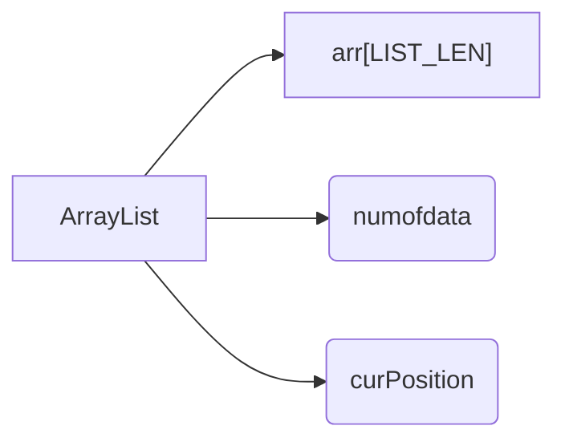

# ArrayList

## 1. Introuction
It's the **List** based on **Array**.
 
 
## 2. ADT and Functions of ArrayList

### 2-1.  ADT
 The Composition of the **ArrayList** as follows.

 

> **LIST_LEN** is defined constant as 100.
- **arr[LIST_LEN]** : It's the array that contains the datas that are inserted.
 

- **numofData** : It's an integer that contains how many datas are in arr[LIST_LEN].
 

- **curPosition** : It's an integer that contains the top position in arr[LIST_LEN].
 
 
### 2-2. Functions
---

>Those functions are written for the basic functionality of ArrayList like **Inserting, Deleting, Searching.**

#### 1. ListInit

#### 2. LInsert
#### 3. ListPrint
#### 4. LRemove
#### 5. LCount
#### 6. LSearch

## 3. Pros and Cons

#### 3-1 Pros
#### 3-2 Cons

## 4. Conclusion

