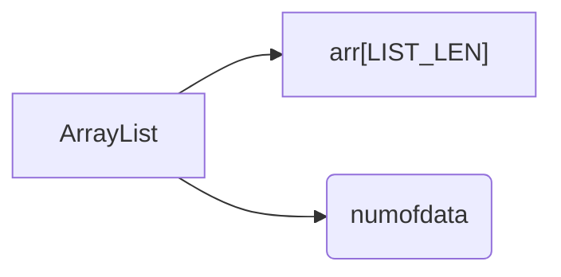
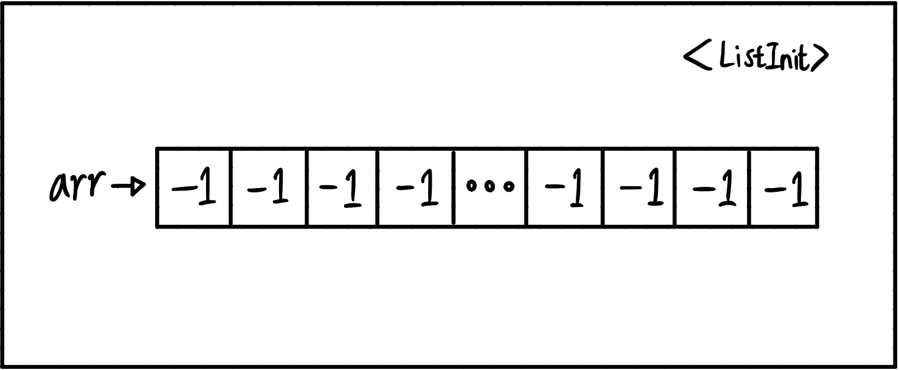
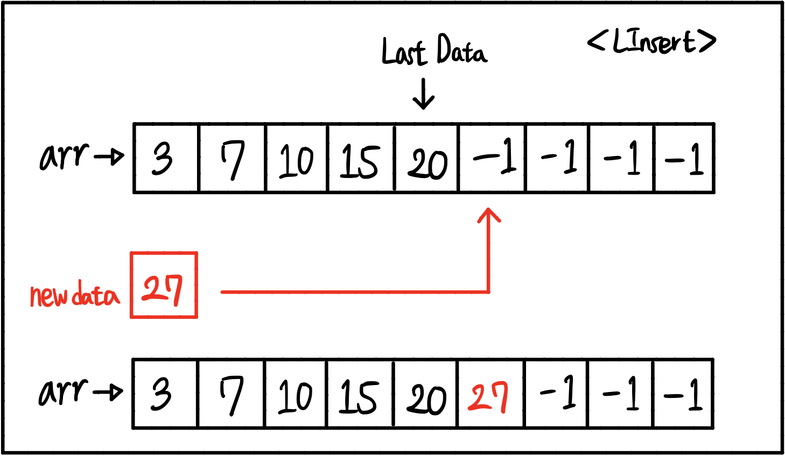
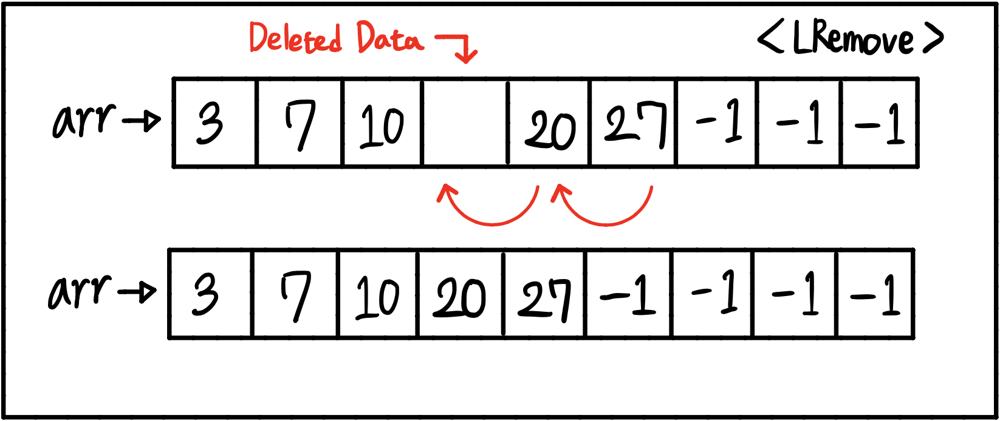

# ArrayList

## 1. Introuction

It's the **List** based on **Array**.
 

## 2. ADT and Functions of ArrayList

### 2-1. ADT(Abstract Data Type)

The Composition of the **ArrayList** as follows.

 

> **LIST_LEN** is defined constant as 100.

- **arr[LIST_LEN]** : It's the array that contains the datas that are inserted.
   

- **numofData** : It's an integer that contains how many datas are in arr[LIST_LEN].

 
 

### 2-2. Functions

> Those functions are written for the basic functionality of ArrayList like **Inserting, Deleting, Searching.**

 

#### 1. ListInit

It is the function that initializes the **ArrayList**. By setting all components of arr[LIST_LEN] as -1, the arr has all default values.
 
 

#### 2. LInsert

It is the function that inserts the new data next to the last input data(not '-1') in ArrayList.
 
 

#### 3. ListPrint

It is the function that prints the components of ArrayList by linear order.
 
 

#### 4. LRemove

It is the function that removes the selected component in ArrayList. After the selected data is removed, other datas which are behind the selected one are moved to the left by one index.
 
 

#### 5. LCount

It is the function that returns the number of Data which is same as **numofData** in ArrayList.
 
 

#### 6. LSearch

It is the function that finds the data that you want to find by input the integer data. Its searching algorithm is just the linear search.

## 3. Pros and Cons

### 3-1 Pros

- Its design is so **simple to use and understand**.

### 3-2 Cons

- As you can see in the process of the removal, it requires **additional movements** of other datas.
- Because it is based on array, the size is limited to specific constant which means that it is **impossible to change the maximum size** of the ArrayList.

## 4. Conclusion

It is one of the simplest list that can be useful. However, it has limitations to the array size and unnecessary processes to handle the removal process.

These defects can be supplemented by using the **linkedlist**.
