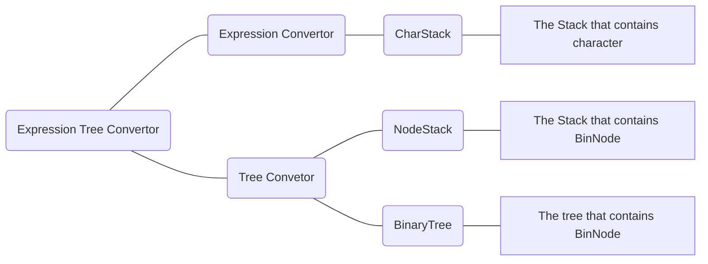

# ChainHash

# 1. HashTable

 

 

## 1-A. What is Hash?

 

 

 

The general data structures that I have introduced has some problems of wasting. For example, the ArrayList which is an LinkedList using array has problem of waste when trying to delete any node. As you can see in _Figure 1-1_, the deleting one node in ArrayList causes the problem of moving other behind nodes which causes wasting time.  

 

 

 

For dealing with this problem, the Hash is needed. Hash is the new method to give index for insertion or deletion. For making index, hash uses hash function that converts given input index into key index for table. The table that features the hash is called Hashtable. Even though Hash functions can have many expressions, in general and in this chapter, the hash function is just dividing given index by the size of table. By doing so, the new node can be inserted like _Figure 1-2_ which will not cause the problem that can be happened in ArrayList like _Figure 1-1_.

 

 

## 1-B. Problem of HashTable

 

However, the HashTable can cause another problem which is called collision. The problem of collision is happened when two other nodes has the same key index which is generated by hash function. In this case, the new one has no seat for itself as the old one which has same key index has been occupying. For overcoming this problem, the two problems are considered.

 

 

 

 

One way is called "Open Address". Open Address is the method of finding the new empty index instead of existing filled index. By adding an integer to existing key index, the new key index is created. This process is repeated until the new created key index is the empty index. The other way is called "Chaining". Chaining is the method that connects the existing node with new node as LinkedList which are having same key index.

 

In this chapter, instead of open address method, the Chaining method will be introduced.

 

 

## 1-C. How to convert expression to ExpressionTree?

 

If we are given infix expression, how can we change it as an expression tree? Before doing it, the **change from infix expression to postfix expression is required**.

 

What changes it to postfix expression is [Expression Convertor](https://github.com/Yangseungchan/DataStructure-based-on-C/tree/master/Stacks/ExpressionConvertor) which has been done in chapter **Stacks**. By changing to **postfix expression**, it can be easier for system to **convert expression to expression tree**.

 

After that, it's now ready to change postfix expression into expression tree. For this process, the two data structures are required. One is **Binary Tree** which is **needed for visualizing expression tree**. This is the changed version of [Binary Search Tree](https://github.com/Yangseungchan/DataStructure-based-on-C/tree/master/Tree/BST) which **has no searching function**. The second data structure is **Stack that contains nodes which are same nodes in Binary Tree** for **inserting nodes into Binary Tree**. How can be done with these two data structures?

 

 

 

Let's build an expression tree with **postfix expression** such as **"7 4 2 \* + 1 -"** which came from **infix expression** **"7+4\*2-1"**.

 

Unlike the convertor from infix to postfix, **the operands are pushed into stack** like above **#1** in _Figure 1-2-1_ . However, when **an operator is read**, the operator **becomes the root node** of the subtree. And **the two nodes**(mostly operands but sometimes operators) **which were pushed previously** are **popped for making an expression as a pair of one operator with two operands** like above **#2-1 ~ #2-2** in _Figure 1-2-1_.

 

What you can notice is that the **first popped operand becomes right child** of the operator and the **second popped one becomes left child of the operator** which is for **making them in the order of calculation**. Once the subtree which has three nodes is made, the **root node of the subtree is supposed to be pushed into stack**.

 

 

 

 

Likewise, if the operator is read, then the **two nodes which had been pushed is popped to create the subtree** like above _Figure 1-2-2_. Then **the newly made subtree is pushed into Stack**. These processes are **repeated until there is nothing to read from given postfix expression**. After the processes are done, finally, the finshed expression tree is created like _Figure 1-2-3_.

 

 

 

To sum up those things, it can be summarized as above _Figure 1-3_.

 

 

# 2. ADT(Abstract Data Type)

 

 

## 2-1. DataStructures for Expression Tree Convertor

 

 

 

## 2-2. Source codes' flows of ExpressionTree

 

 

As I mentioned, **for converting given expression into expression tree**, it is needed to convert it to **postfix expression**. The ExpressionConvertor uses two source codes named _CharStack.c_ and _ExpressionConvertor.c_. After that, the **postfix expression needs to be converted into ExpressionTree** using **Tree Convertor**. **Tree convertor** uses three source codes named _NodeStack.c_, _BinaryTree.c_ and _ExpressionTree.c_. Above _Figure 2-1_ is the diagram about these procedures.

 

 

# 3. Functions

As you can see in _Figure 2-1_, the **expression tree is composed of three parts**. The **first one is Expression Convertor,** the **second one is the Tree convertor** and **the third one is Main Function part**. Because I already discussed about the first part in chapter [Expression Convertor](https://github.com/Yangseungchan/DataStructure-based-on-C/tree/master/Stacks/ExpressionConvertor), I will talk **the second part which is about converting to tree from postfix expression** and **the third part which is about main function** which **includes converting to expressions from expression tree**.

 

 

## 3-1. Tree Convertor

 

 

## 3-1-A. BinaryTree.c

 

### A-1. void ConnectNode(BinNode *nde, BinNode *left, BinNode \*right)

 

It is the function that **connects the BinNode nde with the two BinNodes as the childs**.

 

 

### A-2. int RemoveTree(BinNode \*\*root)

 

It is the function **removes the tree when disallocating the allocated the ExpressionTree**. It accesses all nodes in BinaryTree **recursively** as it is supposed to remove **all root nodes of subtree in the one whole BinaryTree**. As you can see in the code of this function, the **left node of the current root node becomes new root node of the left subtree**. And **the right node is done as the same way with left node**. After it removes the root node of current tree, the function is exited.

 

 

Other functions are skipped as there is no big difference compared to [Binary Search Tree](https://github.com/Yangseungchan/DataStructure-based-on-C/tree/master/Tree/BST).

 

 

## 3-1-B. NodeStack.c

 

### B-1. BinNode *\_Pop(BNStack *stk)

 

It is the function that **pops the top component of stack and returns the top BinNode**.

 

 

Other functions are skipped as there is no big difference compared to [CharStack](https://github.com/Yangseungchan/DataStructure-based-on-C/blob/master/Tree/ExpressionTree/CharStack.c)

 

 

## 3-1-C. ExpressionTree.c

 

### C-1. int is_digit(char \*token)

 

It is the function that **checks whether the given token(a collection of chars) is number or not**. It checks **two conditions** to confirm it. **One condition is checking the return value of function atoi** which changes the given string into number and **returns 0 if given token is not number**. **Second condition is the given string is not "0" using strcmp** because there can be cases that the given token is "0". By theses conditions, the given token is decided to be digit then it returns _TRUE(1)_. Else it returns _FALSE(0)_.

 

 

### C-2. BinNode \*MakeExpTree(char expression[MAXEXP])

 

 

 

It is the function that **makes expression tree using given postfix expression**. This function can be expressed as the above _Figure 3-1_.

 

As I mentioned in **_chapter 1-B_**, the process of converting to expression tree becomes different by checking that the digit is read or not using function **is_digit**. When the **digit is read**, **the new node for BinaryTree is created and contains the read digit** like upper one in _Figure 1-2-1_. However, **if the read one is not digit but operator** then **the new node that contains operator is created popping two nodes in Stack for creating new subtree** like lower one in _Figure 1-2-1_.

 

These processes **are repeated until there is no more things to be read in given postfix expression**. After that, the **root node of expression tree becomes a node at top of the stack** which is returned at the end of this function. Before returning the root node. **it clears out the allocated stack** which is **used for converting process**.

 

 

### C-3. int EvaluateExpTree(BinNode \*nde)

 

 

 

 

It is the function that **evaluates the total value of the given expression tree**. As you can see the code of this function, it is **recursive function**. The reason I made this function as recursive function is that the converted expression tree is **the collection of subtrees**. As you can see in _Figure 3-2_, the converted expression tree can be considered as the **collection of subtree which has one operator with two operands.** That's why the expression tree can be expressed easier like the _Figure 3-3_.

 

Based on these facts, calculating the expression tree should be done **after calculating left subtree and right subtree**. After **finishing calculation of left subtree and right subtree** which becomes each left operand and right operand, **the calculation between these two operands is done based on the read operator**. And then it returns the result value to become the upper tree's operand.

 

 

### C-4. showInfixExp(BinNode *nde), showPostfixExp(BinNode *nde), showPrefixExp(BinNode \*nde)

It is the function that **converts the given expression tree into infix(or postfix or prefix) expression**. What you have to do is just **traveling the given tree as the appropriate order**. For example, function showInfixExp is supposed to **travel the expression tree by preorder traversal visiting in order of left child, root node, right child.** And for **improving the visuality**, whenever the root node value is printed, **the space(" ") is inserted.**

 

 

# 4. Conclusion

It is the program that **converts the given expression into expression tree and convert it into expression again**. As this program uses both stack and binary tree considering the rules of expression for realizing this function, it is considered one of the most complicated programs in my thought.
