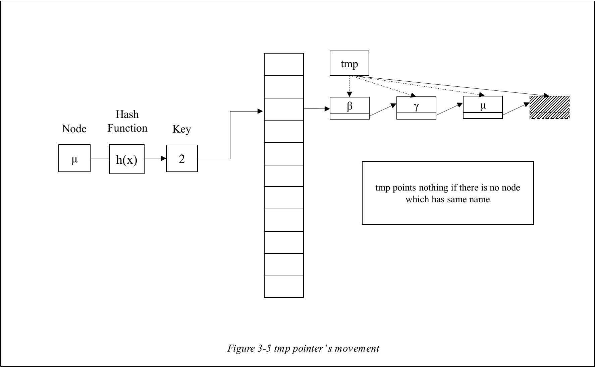
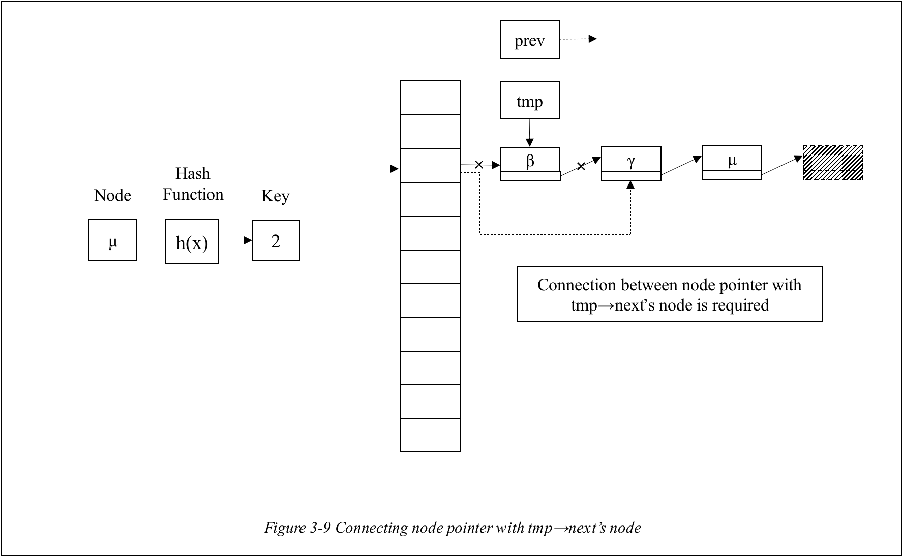

# ChainHash

# 1. HashTable

 

 

## 1-A. What is Hash?

 

 

 

The general data structures that I have introduced has some problems of wasting. For example, the **ArrayList** which is an LinkedList using array has problem of **causing unnecessary movements when trying to delete one node**. As you can see in _Figure 1-1_, the **deleting one node in ArrayList causes the problem of movements of other behind nodes** which causes wasting time.

 

 

 

For dealing with this problem, the **Hash** is introduced. **Hash is the new method to give index for insertion or deletion**. For making index, hash uses hash function that converts given input index into key index for table. The table that features the hash is called **Hashtable**. Even though **hash functions** can have many expressions. As you can see in Figure 1-2, the **hash function** can be just basic expression using quadratic function. This function produces **proper key** which is the **position index of new node**.

 

 

## 1-B. Problem of HashTable

 

However, the HashTable can cause another problem which is called **collision**. The problem of collision is happened when **two other nodes has the same key index** which is generated by hash function. In this case, the new one has no seat for itself as the old one which has same key index was already inserted. For overcoming this problem, the **two solutions** are usually considered.

 

 

 

 

One way is called **Open Address**. **Open Address** is the **method of finding the new empty index instead of existing filled index**. In the case of the _Figure 1-3_, **by adding integer until finding empty index**, it fills the empty space with new node.

 

The other way is called **Chaining method**. **Chaining** is the method that connects the existing node with new node as LinkedList which are having same key index like _Figure 1-4_.

 

Each method has **advantages** and **disadvantages**. In case of **Open Address**, as each table's blank is filled with only one node, this method **requires only O(1) when searching one node**. However, as **it should find blank table until the new node can be inserted** into blank table, **it requires more time when the node is inserted** than **Chaining method**. And also, **its capacity of nodes are limited to its table size**. On the other hand, in case of **Chaining method**, unlike the **Open Address**, it **doesn't have to find any blank node for insertion** as **it inserts new node by linking with existing node**. But, it can **spend more time to search specific node** as it is **chained with other nodes** like _Figure 1-4._

 

In this chapter, instead of **Open Address** method, the **Chaining method** will be introduced.

 

 

## 1-C. How to do Chaining nodes?

 

 

 

 

**Chaining** one node with other nodes is not that difficult job. As what you have to do is just utilizing the **LinkedList**. Let's imagine the situation that **inserts the new node into HashTable**. As you can see in above _Figure 1-5_, let's assume that **the new node which has α has key value as 2** which is produced by hash function h(x). Because the **LinkedList** in key value 2 has other nodes, **the new node α should be chained** with other node **which is the end of the chain** of the key value 2 table. So the **new node α is supposed to be inserted next to the node μ**.

 

To do so, at first, **it finds the last position of the LinkedList** by **checking whether the next pointer in the node points nothing** or not. . For example, in _Figure 1-6_, the last position is the **node μ** as **its next pointer in this node points nothing**. Then the **new node is inserted into the position next to node μ**.

 

 

# 2. ADT(Abstract Data Type)

 

 

## 2-1. DataStructures for ChainHash

 

 

 

- **ChainHash** has integer value **which contains the size of the HashTable** and **Node double pointer** which points the **Node pointer** that points the **Node**.

* **Node** contains **structure Member** and **Node pointer next** which **points the next Node**.

- **Member** contains **char type pointer(actually the char type array)** and the **integer value** that contains **number(no)**.

 

 

# 3. Functions

 

 

# 3-1. Member(.c)

 

## 3-1-A. int cmpMemberName(const Member *m1, const Member *m2)

 

This is the function that **compares the names between Member *m1 and Member *m2** using **strcmp** from **<string.h>**. The **parameters** are **const** for **preventing them from being changed** by this function.

 

 

## 3-1-B. int cmpMemberName(const Member *m1, const Member *m2)

 

This is the function that **compares the numbers between Member *m1 and Member *m2**. If **m1's number is bigger**, then it **returns 0**. Else it **returns -1.**

 

 

## 3-1-C. Member ScanMember(char \*message, int sw)

 

This is the function that **scans the Member's datas** when the node needs to be **inserted or deleted or searched**. The Input data **sw** is the indicator whether this function will scan **only name** or **only no** or **both of them**. For example, if you want to **scan only name**, then **sw** should be **MEMBER_NAME**. If you want to **scan both of them**, then **sw** should be **MEMBER_NO | MEMBER_NAME.**

 

 

# 3-2. ChainHash(.c)

 

## 3-2-A. void Initialize(ChainHash \*chain, int size)

 

It is the function that **initializes the Chain HashTable**. To create **Chain structure pointer array**, **ChainNode** is allocated **Node pointers that points node** and **their quantity** is the **size**. After that, the **size** is set as **input size**.

 

 

## 3-2-B. int HashFunc(char *name, ChainHash *chain)

 

 

 

It is the **function that creates key value** according to the **input name** and the **size of HashTable**. First, it creates a value which is **the sum of characters' integer values of name using integer type casting**. After that, it returns **the sum which is divided by the size of Chain HashTable**.

 

 

## 3-2-C. Node *SetNodeInfo(Member data, Node *next)

 

It is the function that **allocates and sets the new node** to be **inserted into HashTable**. After it allocates new node, it **sets the Node's no and name**. In case of the name, it uses **strcpy** from **<string.h>**. After that, it makes **next pointer in Node point to the input** next for **connecting them**.

 

 

## 3-2-D. int Add(ChainHash \*chain, Member data)

 

It is the function that **adds the new Node into HashTable**. **Based on the data's name**, it **creates the key value** using **HashFunc**. After that based on the **Member data**, it creates new **Node to be inserted**. There are **two cases** for insertion processes.

 

### Case 1 : Node pointer in HashTable at key th points _NULL_.

 

 

 

In this case, what you have to do is just **inserting the new node into HashTable by connecting the new node with Node pointer in key th position**.

 

### Case 2 : Node pointer in HashTable at key value's position points existing Node.

 

 

 

In this case, you have to do **two things** to insert new node. **First**, you have to **find whether the new node's name or no is already used by other existing nodes**. By using **cmpMemberName and cmpMemberNo in Member.c**, you can detect any repeated name or no. If so, the task for **adding new node is failed**.

 

**Next, if repeated things are not detected**, you have to **find the Node that its next pointer points nothing to look for the postiion to be inserted**.

 

These processes are repeated **until the current node's next pointer points nothing** like above _Figure 3-3_. After they are done, the **new node is inserted into that position**.

 

 

## 3-2-E. int Delete(ChainHash *chain, char *name)

 

 

 

It is the function that **deletes the node in the HashTable** **which has same name with the given input name.** For doing so, you have to **get the key value from given input name.** By using **HashFunc which creates key value**, you can get the key value. After that, **using given key value, you have to reach to the Node pointer in key th** HashTable. **Searching through all Nodes in the key th** ChainHash, it **compares the input name with the name in the selected node**. If **two names are considered to be same by strcmp in <string.h>**, then the **selected node should be deleted**.

 

**For making existing nodes to be connected** with each other nodes **except the node to be deleted**, the **two pointers that points Node are needed**. On this function, **tmp** and **prev** are used. Pointer **tmp points the target node to be deleted** and **prev points the node** which is **in front of the node pointed by pointer tmp**.

 

 

After it finds the target node to be deleted by using **strcmp**, it **checks whether the tmp points a node**. **If not so or tmp points no node, the deletion processes are failed** as there is nothing to be deleted. However, **if it finds the same name in other node with tmp,** there are **two cases for deleting a node**.

 

### Case 1 : Prev points a node.

 

 

 

It is the case **when the target node is positioned after at least one node**. In this case, as you should delete only the node which is pointed by pointer tmp, **you still have to preserve the connection between the nodes.** For doing so, you have to **connect the node that is pointed by pointer prev and the node which is pointed by tmp->next** like _Figure 3-7_.

 

 

### case 2 : Prev points nothing.

 

 

 

It is the case when **prev points nothing** which means that **tmp points the node which is pointed by Node pointer in key th HashTable** like _Figure 3-8_. In this case, what you just have to do is connecting **Node pointer** with **the node which is pointed by tmp->next** like _Figure 3-9_.

 

 

 

After these processes of connection are done, **you have to delete the target node** which is **pointed by pointer tmp**. The **processes of removing tmp's node** are done like _Figure 3-10_. First, you have to **remove the relationship between tmp node with tmp->next's node**. After that, **you must make the tmp node free**. After all these processes are done, the removing node process is finally finished.

 

## 3-2-F. int Search(ChainHash *chain, char *name)

 

It is the function that **finds the node in the HashTable which has same name**. First, based on the hash function, it **finds the key value using given name**. And then it **searches through the key th hashtable to find the node which has same name**. Most of the processes which are done for searching **are similar to the processes of removing node**.

 

 

## 3-2-G. void Terminate(ChainHash \*chain)

 

 

It is the function that **disorganizes the HashTable by deallocating all nodes in HashTable**. While doing it, **two pointers(ptr, next) are required to disorganize the HashTable**. Pointer **ptr is the pointer that points the target node to be deleted**. And pointer **next points the node which is behind of the node that is pointed by ptr**. Once **ptr and next points a node**, it starts to **deallocate the node pointed by ptr**. And then **the pointer ptr and next is moved to next node**. **These processes are repeated until it clears all nodes**.

 

 

## 3-2-H. void PrintHash(ChainHash \*chain)

 

 

It is the function that **prints the HashTable in the form of the ChainHashTable** like above _Figure 3-12_.

 

 

# 4. Conclusion

It is the program that **realizes the HashTable based on the Chaining method**. As it includes the LinkedList for the chaining method, the Chain-HashTable is not that hard data structure to realize.
