# LinkedList

## 1. Introuction
It is called as **LinkedList** as it uses the **Node** structure that points to the **next Node**.
 
 
## 2. ADT(Abstract Data Type)

 The Composition of the **LinkedList** is as follows.

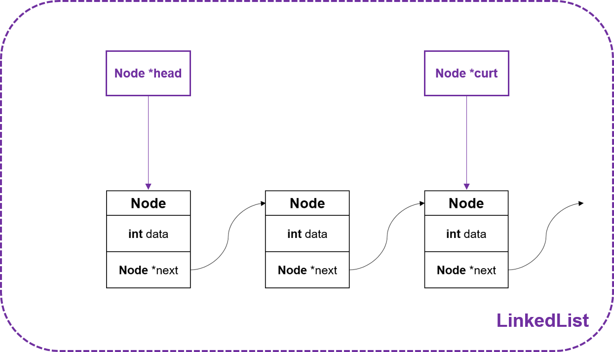
>**Purple colored ones** are the structure of **LinkedList** and **Black Nodes** are **Nodes**.

 

- **Node** : It's the node structure that contains the **integer type data** and **Node type pointer** which points **the next node** for **linking**.
 

- **head** : It is a Node type pointer that points  the **leftmost node** in linkedlist. As it is used as a start node in LinkedList, it is called **head**.
 

- **curt** : It is a Node type pointer that points the **currently used node** in linkedlist. The curt node is consistently renewed whenever the linkedlist performs **Insert** or **Delete**.

 
 

## 3. Functions

Those functions are written for the functionality of the **LinkedList** such as **Initializing, Inserting, Deleting, Searching and Printing**.

 

> Type **LinkedList** is renamed as the **Llist** for the simplicity.

 

### 1.  void InitList(Llist *list)

It is the function that initializes the **LinkedList**.  By setting **head** and **curt** as **NULL** which means those two pointers are not pointing anything.
 
 

### 2. Node *SetNode(const int data, Node *next)
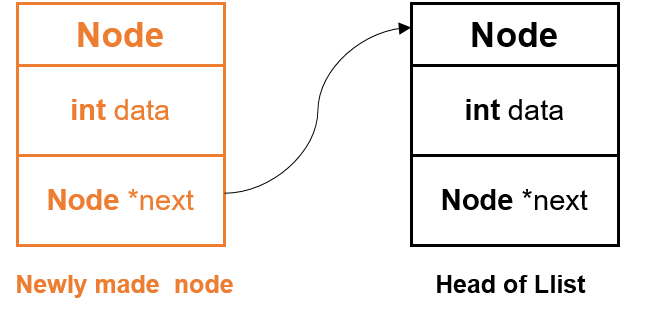

It is the function that **allocates** and **returns** the node which got data as **input data** and points the **input next node**.
 
 

### 3. void InsertFront(Llist *list, const int data)
It is the function that **inserts the new node** at the **LinkedList head**.  The processes of the function **InsertFront** is as follows.

1. It allocates the new node and newly made node's **next node pointer** points the **head of LinkedList** by setting the input next pointer of SetNode as **head of LinkedList**.

2. This new made Node is pointed by Node type pointer **ptr**.
 

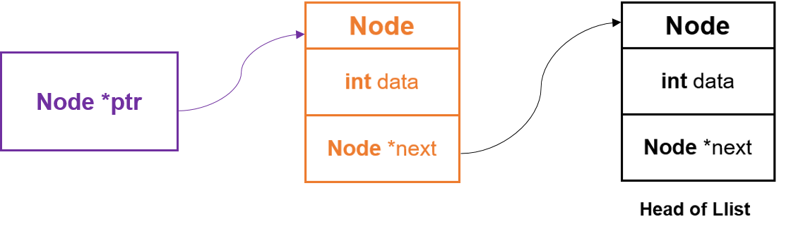

 

3. This new made Node( = **Node that is pointed by ptr**) is pointed by head of LinkedList to be positioned at the head of the LinkedList.
 

4. And the Node type pointer curt also points the Node that is pointed by **ptr**(= **newly made node** = **new LinkedList head**).
 
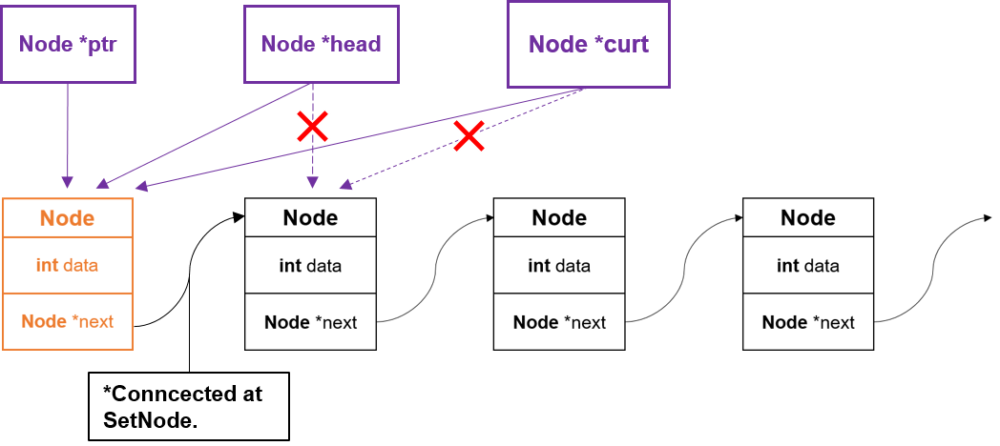

 
 

### 4. void InsertRear(Llist *list, const int data)

It is the function that **inserts** the new Node at the **end** of the LinkedList.

1. At first, it checks whether there is at least one node in the LinkedList. If there isn't any nodes, it calls function **InsertFront** instead.

> **Q : Why does it call InsertFront instead?**
> A : When  there is no node in LinkedList, its result is same as calling InsertFront. And also InsertFront is much easier and cheaper in cost than InsertRear, as InsertRear requires at least 2 Node type Pointers.

2.  If there is any node in LinkedList, then make new node and let it pointed by Node type pointer **ptr** like InsertFront.
 
3. And LinkedList's **head node** should be pointed by Node type pointer **prev** to find the position of the inserted node.

 
 

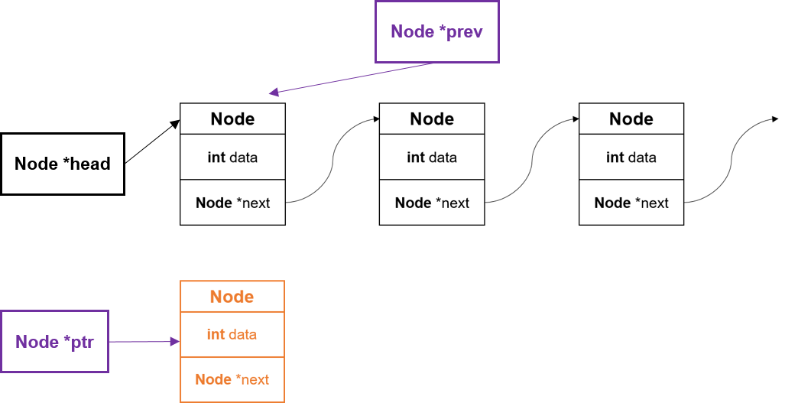

 
 

4. Pointer **prev** is moved to right until it reaches before the **end of the LinkList** which means the node's next pointer is **NULL**.

5. After it finds the position, **prev's next pointer(=prev->next)** should point to the **new node(=ptr)**.
6. And also the **Llist's curt(=list->curt)** pointer should be pointing to  the **new node(=ptr)**.

 
 

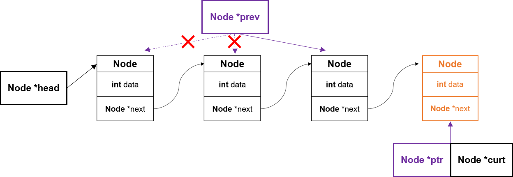

 
 

### 5. int RemoveFront(Llist  *list)
It is the function that **removes** the **front node** in the LinkedList. The processes of  the function is as follows.

1. At first, check whether there is no node or not. If there is no node in the LinkedList, then it return *false* as there is no node to delete.

 

2. If not, the **node to be deleted** which is same as **the head of the LinkedList** should be pointed by Node pointer **ptr** to be a parameter of the function **free()** later.

 

3. And then, the **head node(list->head)** of the LinkedList should be renewed to the **next node of the head node(list->head->next)**. 

 

4. Then the node which is pointed by pointer **ptr** is freed by function **free()** and **RemoveFront** returns *TRUE*.

 
 

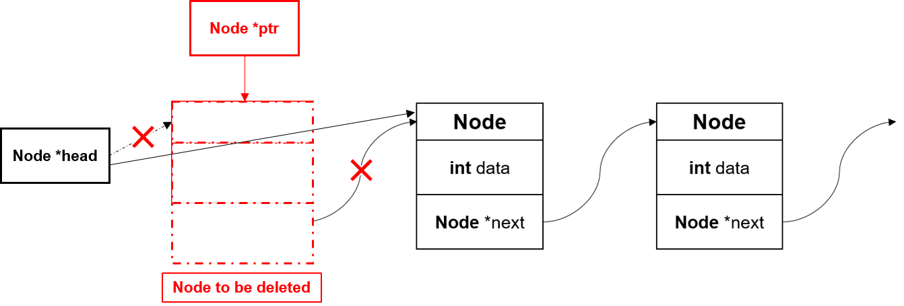

 
 

### 6. int RemoveRear(Llist *list)
It is the function that **remove** **the last node of the LinkedList**. The processes of the function is as follows.

1. First, it checks **whether it has node or not.** If not, it return *false* as there is no node to delete.
 

2. After that, it checks how many nodes are in LinkedList. If it has **only one node**, then it calls function **RemoveFront**. As it is more low-priced than using function **RemoveRear**.
 

> **Q : How can I check whether the LinkedList has only  one node?**
> A : It can  be checked by verify whether head node's  next node(list->head->next) is NULL.  Because this case is **only possible when it has only one node!**
>
>
> 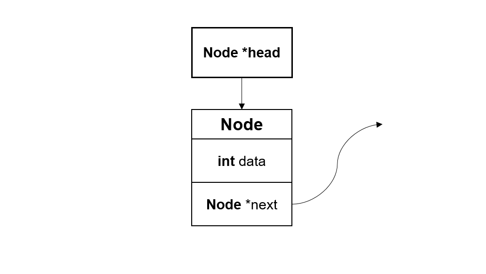

 
 

3. If it is confirmed that LinkedList has **at least two nodes**, Two Node type pointer(**del & before**) is needed. Pointer **del** which will points to the node to be deleted points to the **next node of the list head(list->head->next)**.  And pointer **before** which will points to the node left to the del node points to the **head node of the LinkedList(list->head)**.
 
 

4. **del node** and **before** is **moved to the right** until it finds the **end of the node**. It can be checked by setting condition, ***del->next == NULL***.
 

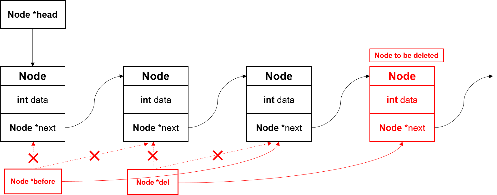

 
 

5. If it reaches the **end of the node**, next node of before is disconnected and **del node** is free by using function **free()**.
 
6. At last, **curt node** of the LinkedList is pointed to the **before node** .

 
 

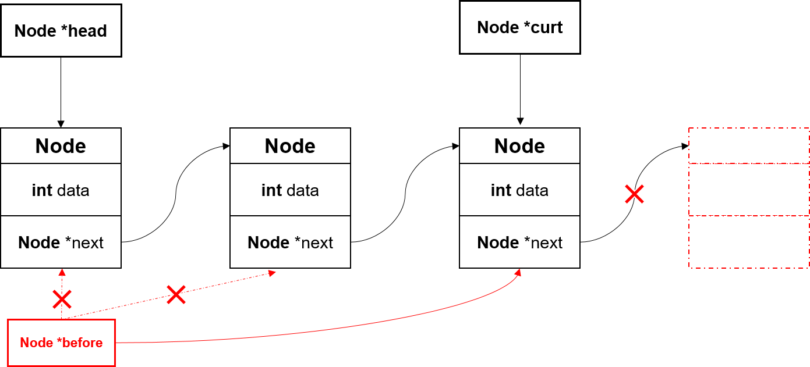

 
 

### 7. int RemoveCur(Llist *list)
It is the function that **removes the curt node** in LinkedList. It also checks the number of nodes in LinkedList. If it is 0 or 1, it acts sames as the RemoveRear. From now on, I will explain only when there are more than two nodes.

1. Node type pointer **before** points to the LinkList head node.
 

2.  Until it reaches right before the curt node of the LinkedList, pointer before moves to the right.
 

3. After that, **before's next** points to the **curt node's next node**(**before->next = list->curt->next**). Because curt node is gonna be deleted soon, before node and curt's next node should be connected.

 
 

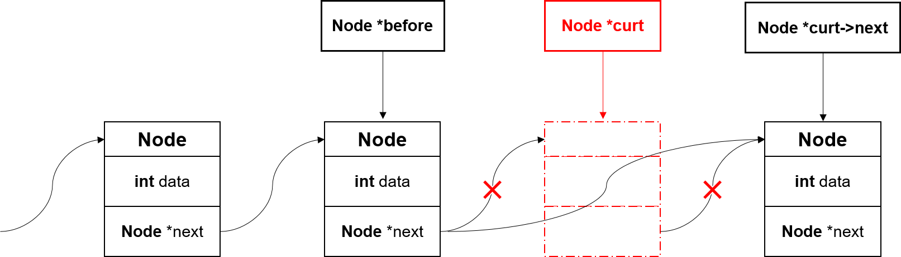

 
 

4. After that, **curt's next** becomes *NULL* to disconnect **before** with **curt** and **curt node** becomes free by free().
 

5. At last, curt node points the **before** to renew the curt node and return *true*

 

### 8. int Search(Llist *list, const int data)
It is the function that **finds the data** moving to the right node until it reaches **the end of the node**. Like **ArrayList Search** Function, when it fails to find the input data, it returns *FALSE*. Else if it finds the data, it returns *TRUE*.
 

### 9. void Clear(Llist *list)
It is the function that **clears the LinkedList** by **removing all nodes** in **LinkedList**. Whenever it removes the front nodes of the **LinkedList** by using the RemoveFront function, the head of the LinkList is changed to the Node which is **right to the head node**.
 

### 10. void PrintList(const Llist *list)
It is the function that **prints the all nodes** in the **LinkedList**. After it finishes to print the data of one node, the pointer **nde** which points the node moves to the right **until it reaches the end of the** **LinkedList**.
 

## 3. Pros and Cons

### 3-1 Pros
- There is **no limitations to the number of data** to contain unlike **ArrayList**.

- There aren't **any unnecessary moves** between data **when it tries to insert or remove data**.

### 3-2 Cons
- Whenever it tries to insert a node in ArrayList, it uses dynamic allocation to make a node. This costs too expensive for system.

## 4. Conclusion
It is one of the list that makes up for the disadvantage of the **ArrayList** which is limited containers and unnecessary moves. However, its allocation is **highly expensive** compared to the **ArrayList**'s insert process.
