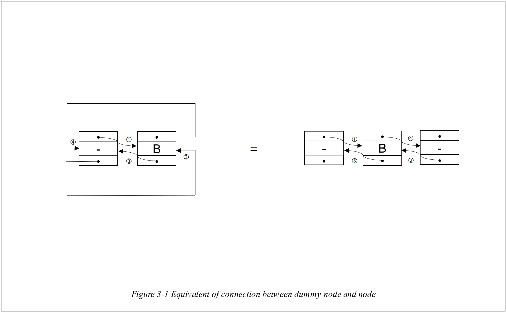
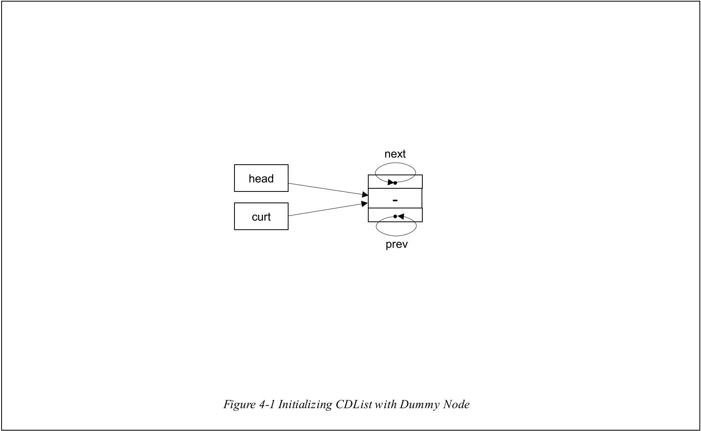

# CircularDoubleList

# 1. Introduction

## 1-A. What is it?

It is the **CircularList** combined with DoubleList based on LinkedList to overcome the **difficulty to reach the tail node.**

 

## 1-B. What is CircularList?

As you can see in _Figure 1-1_, it is the LinkedList which **head node** is connected with **tail node**. Because it can be **circulated** while moving with **next node**, its name is **CircularList**.

 

## 1-C. What is DoubleList?

As you can see in _Figure 1-2_, it is the **LinkedList** which node has **next pointer** and **prev pointer** which points each **next node** and **previous node**.

 

## 1-D. CircularList + DoubleList = ?

 

As you can see in _Figure 1-3_, the **CircularDoubleList** that is going to be introduced in this chapter is combined **CircularList** with **DoubleList**.

You can check each node's component in _Figure 1-4_.

 

## 1-E. Necessity of Dummy Node

 

However, using the **CircularDoubleList** like _Figure 1-3_ can be tricky. Let's check out the insertion processes with **CircularDoubleList** like _Figure 1-3_.

As you can see in _Figure 1-5_, to insert **first node into head** of CircularDoubleList, you have to connect **new node** with **head pointer**.

 

However, like _Figure 1-6_, when you try to insert new node, as there are many cases, you have to handle them **all differently.** For overcoming this tricky situation, I will introduce the **dummy node**.

 

As you can see in _Figure 1-7_, **dummy node** is the node as **same form** of other node which has **no data**. Because you don't have connect head pointer with new node, you can avoid previous tricky situation by introducing **dummy node**. The details of it will be introduced in chapter 3.

 
 

# 2. ADT(Abstract Data Type)

## 2-1. ADT of Node

The structure of the **Node** is as follows.

 
 

## 2-2. ADT of CircularDoubleList

The structure of the **CircularDoubleList** is as follows.

> **Dummy Node** is connected to **head** and **curt** pointer when CDList is **initialized** at first.

 
 

# 3. Principles of Connectivty of Nodes

In this chapter, I will talk about **the principles of connectivity** between nodes in **CircularDoubleList**.

 

## 3-1. Connection with Dummy Node

As you can see in _Figure 3-1_, the connection of **one node with dummy node(inserting at head)** can be reinterpreted as a connection of **one node between two dummy nodes** which is the right side of _Figure 3-1_.

 

As you can see in _Figure 3-1-2_, even though **one new node(green)** is **added at tail** and connected with **dummy node**, **equivalent is still valid.**

 

## 3-2 Connection with other nodes

How about **connection of the nodes which are not dummy nodes?** As I will talk about only **the connection of the nodes which are not dummy node**, I will **except the case of inserting nodes at head or tail** of the **CDList**.

 

According to _Figure 3-2-1_, let's try to **insert new node(node n)** between **two nodes(node p and p->next)**.

 

The result will be _Figure 3-2-2_. What you have to notice is that the situation like _Figure 3-2-2_ where the new inserted node is between node **p** and node **p->next** can be captured even in _Figure 3-1_ and _Figure 3-1-2_. This means that **wherever the new node is inserted, the way to insert new node is always same**.

 

In this situation, when you only look at the **inserted node(node n)**, it can be described as above _Figure 3-2-3_. This applies to any situation **when new node is inserted at head or tail or else**. This means that what you have to do when you insert new node is **connecting these 4 arrows to node _p_ and node _p->next_.** Each arrow which is concerned with node n can be connected by using those codes.

    ① : p->next = n
    ② : p->next->prev = n
    ③ : n->prev = p
    ④ : n->next = p->next

As you can see, these codes requires only **node _p_** and **node _n_**. This means what you have to know when you insert new node is **node _p_** which is **in front of new node**. In other words, you just need to know **where the new node to be inserted behind.**

To sum up the **chapter 3**, following two important rules are induced.

 

### Rule 1 : Once you know where the new node to be inserted behind, whatever the position of insertion is, process of inserting a node is equivalent.

### Rule 2 : Connecting node to other nodes are same with connecting 4 arrows of node like _Figure 3-2-3_.

 

# 4. Functions

> As you can see **header file,** _TRUE_ is **0**, _FALSE_ is **-1** and _Null_ is **-2**.

## 4-1. void Initialize(CDList \*cdlist)

It is the function that **initializes the CDList**.

As you can see in _Figure 3-1_, allocated node's data is set **Null** to nominate it as the **dummy node**. And then its **next** and **prev** pointer points to itself to make it as a **CircularDoubleList**. At last, **head** and **curt** pointer points to **dummy node**.

 

## 4-2. Node *SetNode(int data, Node *prev, Node \*next)

It is the function that **allocates new node**, **sets the data as input data** and **makes next and prev pointer point to the input next and prev pointer**. According to _Figure 4-2_, function SetNode **connects arrow ③ and ④**.

 

## 4-3. void InsertAfter(CDList *cdlist, int data, Node *p)

It is the function that inserts new node right after **Node p**. As I described in **chapter 3**, the i**nsertion process is same as connecting 4 arrows**.

At first line, by using function SetNode, it **connects arrow ③ and ④** in _Figure 4-3_. After that, at second line, it **connects arrow ① and ②**. At last, it renews the pointer curt to new inserted node.

 

## 4-4. void InsertFront(CDList \*cdlist, int data);

It is the function that **inserts new node at first position of the CDList**. Actually, as I already **introduced dummy node as the head node in CDList**, it is same as **inserting new node right after dummy node**. So what you have to do is just call function **InsertAfter** and **set node p as head node(=dummy node)**.

 

## 4-5. void InsertRear(CDList \*cdlist, int data);

It is the function that inserts new node at **tail node of the CDList.** So like **InsertFront**, what you have to do is just **call function InsertAfter** and **set Node p of InsertAfter as the tail node of CDList**. And because it is one of **CircularList**, **tail node** can be described as **head->prev**. Those are all of **InsertRear**.

 

## 4-6. int Delete(CDList *cdlist, Node *target)

It is the function that **deletes the input target node** at the CDList. Like inserting process, **regardless of whether the position of target node is head or tail or else**, the target node can be generalized as below _Figure 4-6_.

 

While the insertion process is connecting 4 arrows, the deletion process is disconnecting and reconnecting 4 arrows.
In deletion, before adjusting 4 arrows, it checks whether CDList has no nodes. If so, it return _FALSE_ **to indicate that it fails to delete target node**.

If it is checked that it has at least one more nodes(except dummy node), then deletion is started.

 

The two lines of codes after checking emptiness **reconnect the arrow ① and ② to connect the _target->prev_ and _target->next_** like above Figure 4-6-2. While doing it, pointer **curt** points to the **target->prev** to renew it.

 

After that, it **disconnects arrow ③ and ④** and frees the **node target** like above _Figure 4-6-3._ After doing these processes, it successfully deleted the **node target**.

 

## 4-7. int DeleteFront(CDList \*cdlist);

It is the function that **deletes the front node of the CDList**. What you have to notice is that **deletion process is equivalent regardless of the target node's position**.

 

At first, it checks whether the **CDList is empty**. If so, it **returns _FALSE_** to indicate that it fails to delete node.
Else, it calls function **Delete** and **target** should be **head node's next node of CDList(cdlist->head->next)**.

 

## 4-8. int DeleteRear(CDList \*cdlist);

It is the function that **deletes the tail node of the CDList**. It is almost same with function **DeleteFront**. What is different at **DeleteRear** is the input target of function **Delete**.

 

As **DeleteRear** is a function that **deletes tail node**, input target should be **head node's prev node of CDList(=cdlist->head->prev).**

 
  
## 4-9. int  DeleteCurt(CDList *cdlist);
  
It is the function that **deletes the curt node of the CDList**. It is also almost same with function **DeleteFront**.

 

As **DeleteRear** is a function that **deletes curt node**, input target should be **curt node of CDList(=cdlist->curt).**

 

## 4-10. int Search(CDList \*cdlist, int data);

It is the function that **searches the node which is same as the input data.** It uses the **Linear Search algorithm**. When CDList is empty or it fails to find the node, it returns _FALSE._ When it succeed in searching, then it returns _TRUE_.

 

## 4-11. void PrintCurt(CDList \*cdlist)

It is the function that prints the curt node's data in the CDList.

 

## 4-12. void PrintList(CDList \*cdlist)

It is the function that prints the all nodes' data in the CDList.

 

## 4-13. void Clear(CDList \*cdlist);

It is the function that **clears the CDList by clearing all nodes**. It deletes all nodes using function **Delete**. And **target input is front node of CDList.**

 

# 5. Conclusion

It is the combined linkedlist which is **a mixture of CircularList and DoubleList**. By making this combination, it complements **the difficulty of finding tail node in LinkedList**. However as it uses the Node type pointer and allocates Node whenever it inserts new node, **its cost can be still somehow expensive**.
