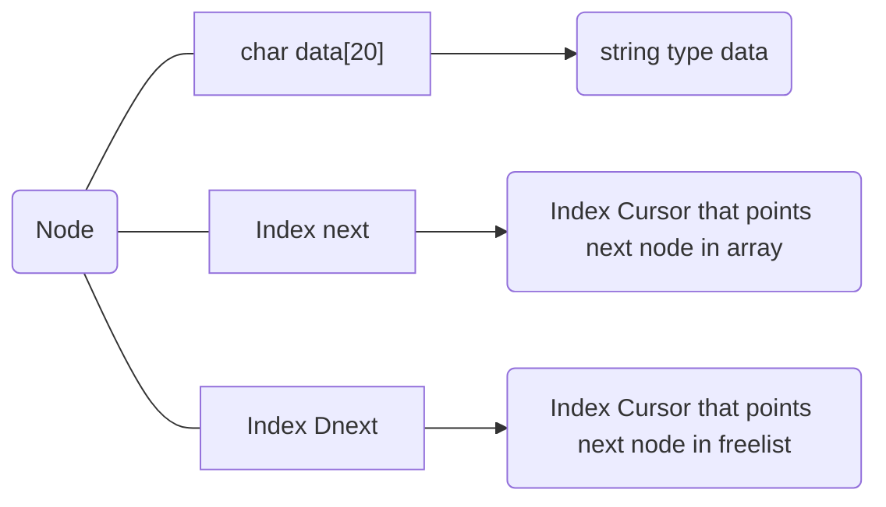
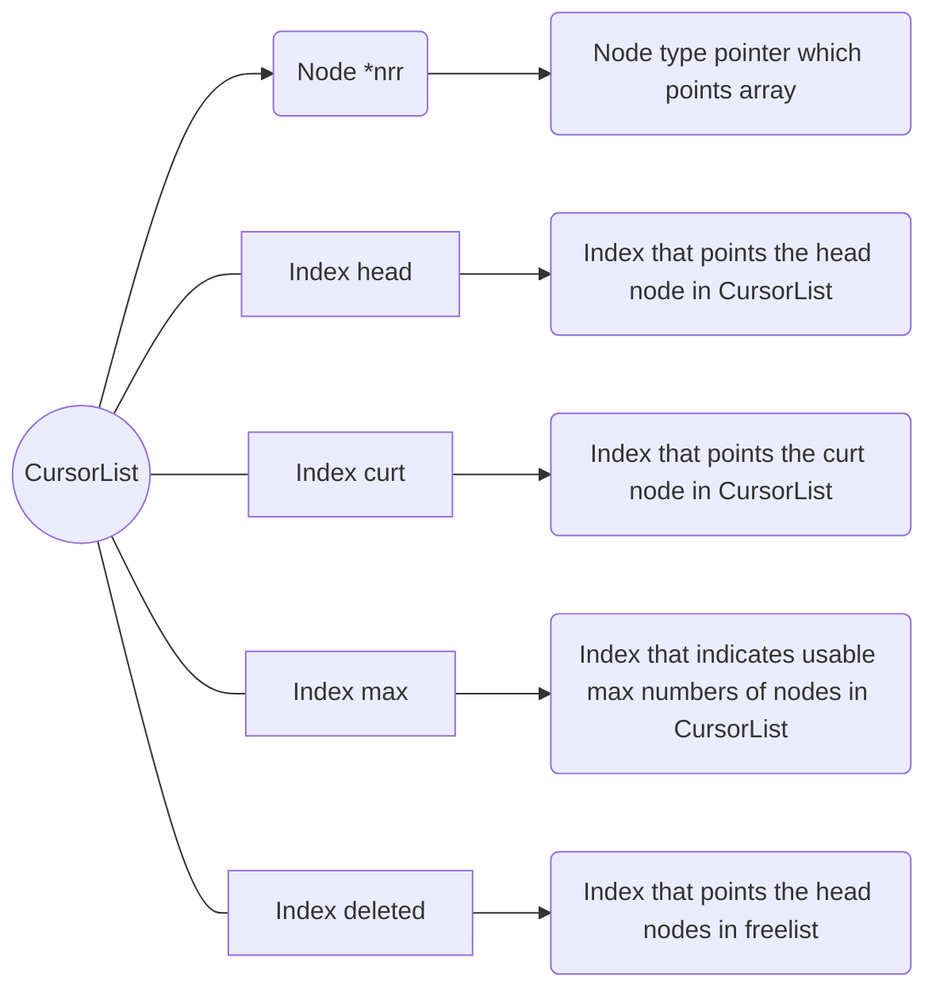

# CursorList

# 1. Introduction

## A. Is LinkedList complete Datastructure?

I introduced you the **LinkedList** previously. However, **LinkedList** has one somehow dissatisfying defect.

 

> Whenever **LinkedList** tries to insert or delete data, it requires **dynamic allocation** or **releasing allocated data**. Its cost is too expensive.

 

In order to overcome this defect, the **CursorList** is gonna be introduced.
 
 

## B. What is difference between them?

**CursorList** is same as **LinkedList** in logical features. However, CursorList is physically composed of **Array**.

 

As you can see in above figure, the upper part is common **LinkedList**. This **LinkedList** can be interpreted as the lower part(**physical Array**). As the next array is called **cursor** which points the next component's index, this structure is called **CursorList**.

 

Then, how **Insertion** can be done on **CursorList**?
Let's assume Node 'E' is inserted next to D and inserted into index 6 in array.

 

 

The new inserted node(blue node) is inserted next to node 'D' and inserted at **index 6** in array. 

 

As you can see, **previous tail node** D's next value is changed to **index 6 from -1** as it is **no more end of the CursorList**. And because node E is the end of the logical linkedlist, **next index** of node E is **-1**.

 

## C. Problem of CursorList

However, this simple **CursorList** has fatal problem. When you try to delete node in CursorList, this causes waste of space in array.

As you can see in above this figure, when you delete node D, then it causes the empty space in array(red one). Considering the limited space of array, this structure will waste a lot of spaces and it causes fatal problems.
For this reason, **FreeList** should be introduced to **CursorList**

 

## D. CursorList with FreeList

**FreeList** is the list that shows the freed(deleted) node's record. Let assume that index 0, 2, 4 is deleted node in **Array** and **LinkedList**.

As you can see this above figure, FreeList shows the records of deleted nodes' indexes.
However, **FreeList** doesn't exist as **physical List**. It is just logically interpreted as LinkedList and is realized by integer variable **deleted** and integer type variable **Dnext**. The variable **deleted** means **the index of head node of the FreeList** and **Dnext** shows the **next deleted node's index**.

 

By recording the deleted nodes' indexes, it can **save empty space** when you **insert and delete data** of **CursorList**.

 
 

# 2. ADT(Abstract Data Type)

> For classification, data type int is renamed by typedef as **Index**.

 

## 1. ADT of Node

 

The structure of the **Node** is as follows.

 

## 2. ADT of CursorList

 

The structure of the **CursorList** is as follows.

> The detailed function of **Index max** will be introduced in function GetIndex.

 
 

# 3. Functions

- As you can see at headerfile **CursorList.h**, constant **END** is defined as **-1** which means that it is the end of the List.

 

> And also constant **EMPTY** is defined as **-2** which means that it is empty without valid value or index.

 

## 1. void Initialize(CList \*Clist)

It is the function that initializes the **componenets of CursorLists**.

- _Index_ **head, curt** is initialized as **END** which means that it has no head or curt node.

- _Index_ **max** is initialized as **END** which means that there isn't any node in the **CursorList**.

- _Index_ **deleted** is initialized as **EMPTY** which means that there has been **no deleted nodes**.

- Node type array **nrr** is allocated **MAX(defined as 500)** Nodes by function calloc. Its components are initialized by next function **InitNodearr**.

## 2. void InitNodearr(Node \*n)

While going around all nodes in Node type array **nrr**, each node's _Index_ **next** and **Dnext** are initialized EMPTY to be distinct from **END** when it means the end of the **CursorList** or **FreeList**.

 

## 3. int GetIndex(CList \*Clist)

It is function that returns the appropriate index to be inserted. It is divided into 2 cases.

#### Case 1. When deleted is _not empty_ which means that there has been at least _one empty space_ in array or _deleted node_.

  
 

1. The **deleted index(green)** is saved by other variable.
    
    

2. The **deleted index** is renewed as index **Dnext of node(blue)** which is pointed by **deleted index**.

3) Saved **previous deleted index(green)** is returned.
    
    

#### Case 2. When deleted is _empty_ which means there is _no empty space_ in array or _no deleted node_.

 

1. If deleted **EMPTY(-2)** which means **FreeList** is empty, then it adds 1 to index **max**.
    
    

2. After that, it returns added **max**

    

## 4. void SetNode(Node *nde, const char *data, Index next)

It is the function that copies the data into new node's data and allocates next and **Dnext** index. As the node **nde** is newly inserted node, its **Dnex**t index is empty.

 

## 5. void InsertFront(CList *Clist, const char *data)

 

It is the function that inserts the new node into **head of the CursorList**.

1. It gets **appropriate index(green)** to insert and deleted is renewed by function **GetIndex**.

 

2. Then function **SetNode** sets data as **input string** and index next as **head index** of the **CursorList**.
    

3. After that, index **head** and **curt**(orange ones) is renewed as **inserted index**.

 

> As you can see, according to the **change of the array**, **logical LinkedList** is also changed.

 

## 6. void InsertRear(CList *Clist, const char *data)

 

It is the function that inserts new nodes into **tail node of the CursorList**.

1. When there is no node in **CursorList**, it calls **InsertFront** instead. As **InsertRear** is far more complex than **InsertFront**.

 

2. If not so, like InsertFront, it gets **appropriate index(green)** to be inserted from **GetIndex**.
    

3. Then it finds the **index of the last node(orange)** of the CursorList by **tracking next index**.
    

4. By using function **SetNode**, it sets the new node's data, next and Dnext.

5. Then it connects **previously last node** with **newly inserted node** by setting **prevously last node(orange node)'s next index** as **newly inserted node's index**.

 

## 7. void DeleteIndex(CList \*Clist, Index target)

It is the function that **1. deletes the data** and **2. adjusts the next, Dnext** and **3. adjusts the index deleted** based on input index which is the index of node to be deleted.

Let's suppose that deleted target is **Node D** then the **red ones** are things to be done by function **DeleteIndex.**

Whenever **DeleteFront, DeleteRear and DeleteCurt** is called, **DeleteIndex** is called.

 

## 8. int DeleteFront(CList \*Clist);

It is the function that deletes the front node in the **CursorList.**

1. At first, it checks whether the **CursorList** is empty or not. If it is empty, then it returns -1 for indicating that it is not possible to remove something.

2. Else, it saves the head index of the **CursorList**.
3. Then, **head and curt index** of CursorList is renewed to **next index of the head node**(refer to red circles).
    

4. Then by function **DeleteIndex**, **deleted index** and **Dnext of deleted node** is adjusted and **data with next index** is cleared.

 

## 9. int DeleteRear(CList \*Clist);

It is the function that deletes the tail node in the **cursorlist**.

1. At first, it checks whether the CursorList is empty. If so, it **returns -1**

2. After that, it checks whether the CursorList has only one node. If so, it calls **DeleteFront**.

 

3. Else, then it finds the node which is **in front of the tail node(=target=the red ones)**.

 

4. The node's (which is in front of tail node) **next index** is changed to **END** for **disconnecting with tail node.**
    

5. **Curt index** of CursorList is changed to **this target node index.**
    

6. By calling function **Deleteindex**, tail node's **data, Dnext** and CursorList's **Deleted index** are cleared or adjusted.

 

## 10. int DeleteCurt(CList \*Clist);

It is the function that deletes the curt node.

1.  If there is no node in CursorList, then it returns -1.
2.  Else if curt is same as head of CursorList, then it calls **DeleteFront** instead
3.  Else if curt is same as tail of CursorList, then it calls **DeleteRear** instead.

> **(Before)**
> 
>  
>
> **(After 4, 5, 6)**
> 

4. Else, it finds the node which is **left to the curt node.** (I'll call this node as **prev** node.)

5. Then, the **next index** of **prev** node is changed to **curt node's next node** index to be disconnected with curt node.

6. After that, by function **DeleteIndex,** **curt node's data, next and Dnext** is adjusted. And also **deleted index** is renewed.

7. At last, **curt index** is changed to current **prev** node index.

 
 

## 11. int Search(CList *Clist, char *data);

It is the function that finds the node which is same as input data. Its searching algorithm is just **Linear Search**.

 

## 12. void PrintCurt(CList \*Clist);

It is the function that prints the information of the **curt node** of the **CursorList.** If there isn't any node in **CursorList**, then it returns **-1**. Else, it prints the data of the **curt node.**

 
  
## 13. void  PrintList(CList  *Clist);

It is the function that prints all of the nodes in the CursorList. Starting from **head node** of the CursorList, it **prints the data of the nodes** until it reaches **the tail of the CursorList**.

 

## 14. void Clear(CList \*Clist);

It is the function that **clears all nodes in the CursorList**. As function **DeleteFront** is the simplest among Deleting functions, it deletes all nodes by using **DeleteFront**. Until **head node's** index is **END(-1)**, it deletes front nodes.

 
 

# 4. Conclusion

## 4-1. Pros

- As CursorList **doesn't require too much allocation and free**, even though, it is same as **LinkedList** logically, its cost to realize and make CursorList is **much cheaper** than **LinkedList**.

 

## 4-2 Cons

- Because it is **based on constant array**, its maximum size to contain is **limited to specific numbers**.
   

- In order to reach the **end of the CursorList(= tail node)**, it takes too much time or costs.

 

## 4-3 How can overcome the difficulty to reach tail node?

- Including **LinkedList** and **ArrayList**, **CursorList** has also difficulty to reach the end of the List.

- To overcome this situation, I will introduce you the **Double Circular List**.
