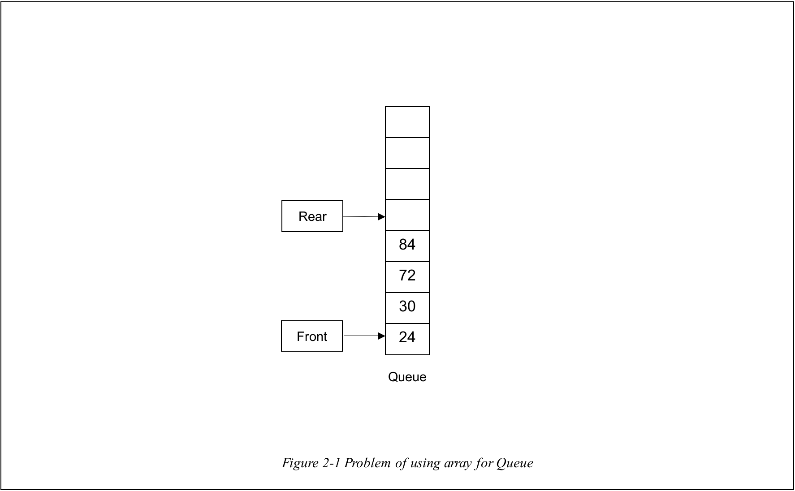
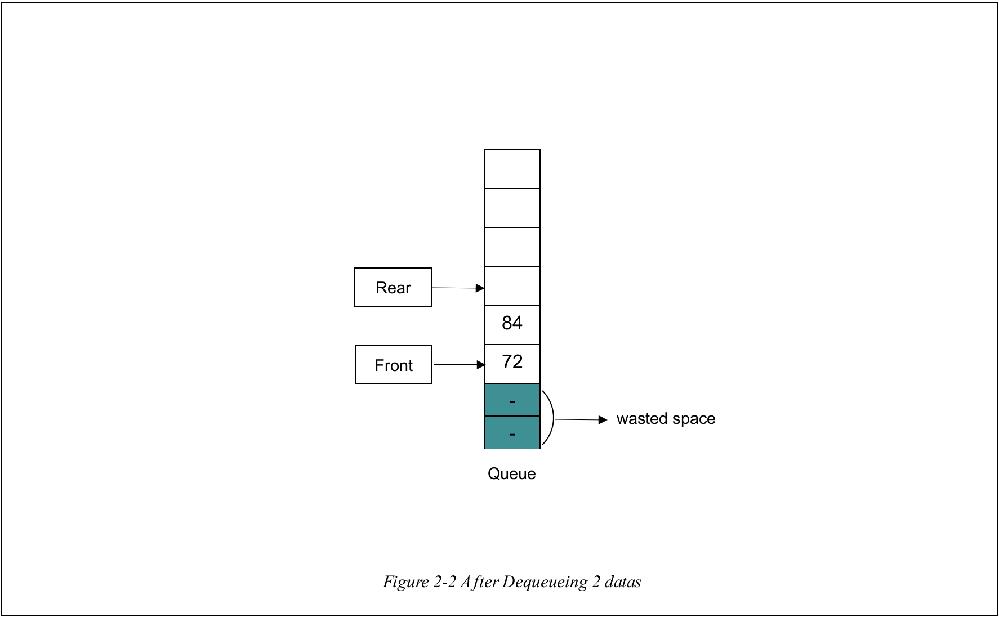
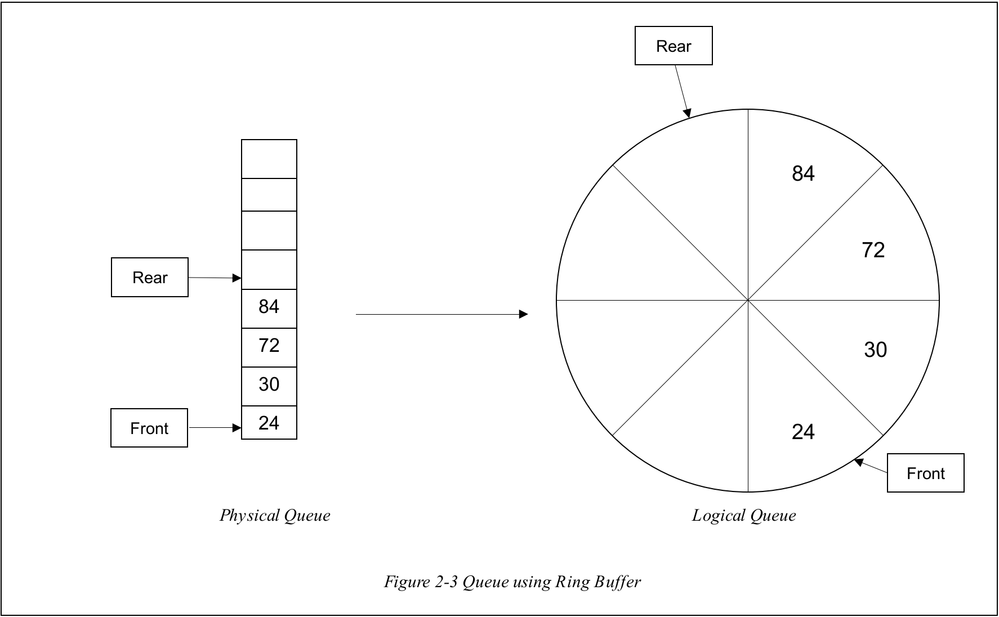
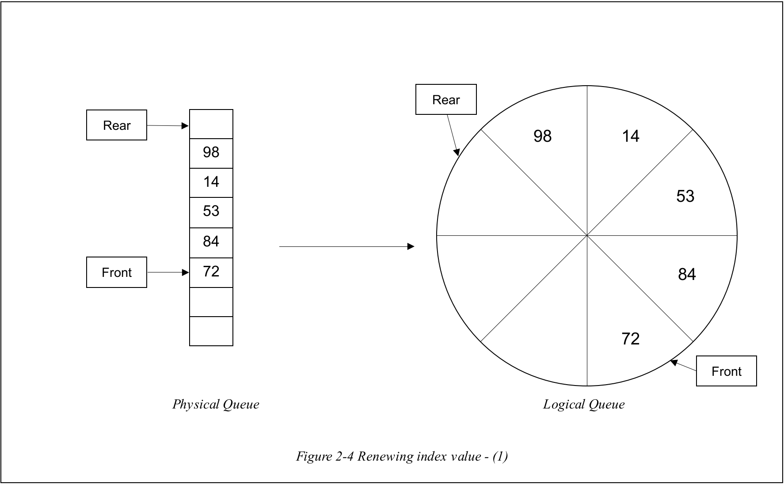
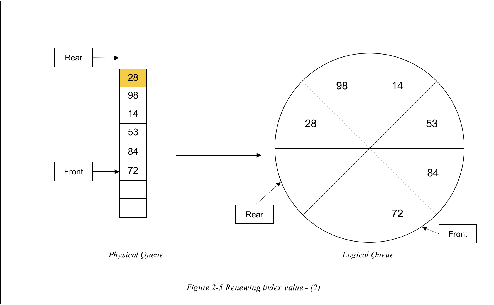
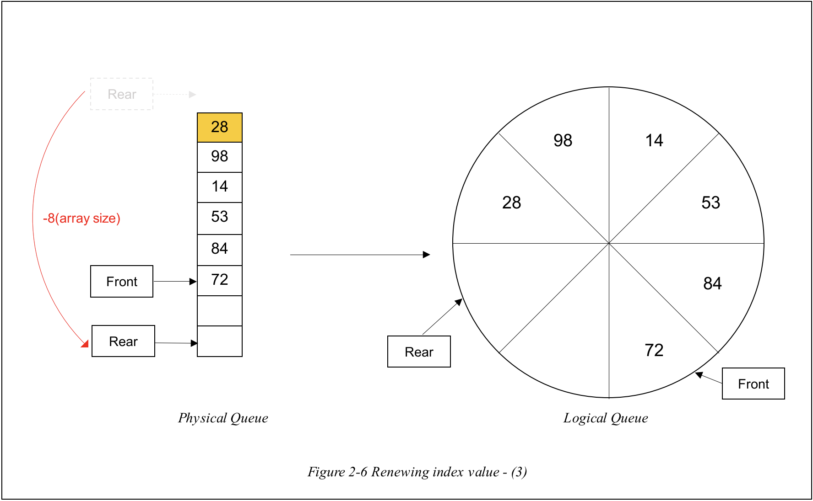
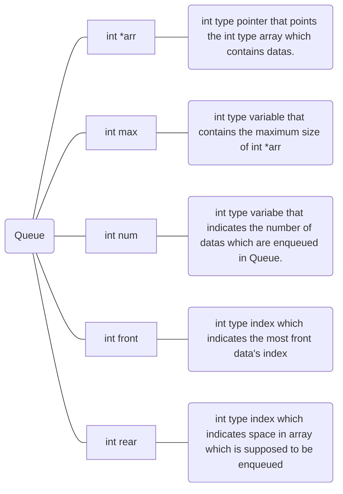
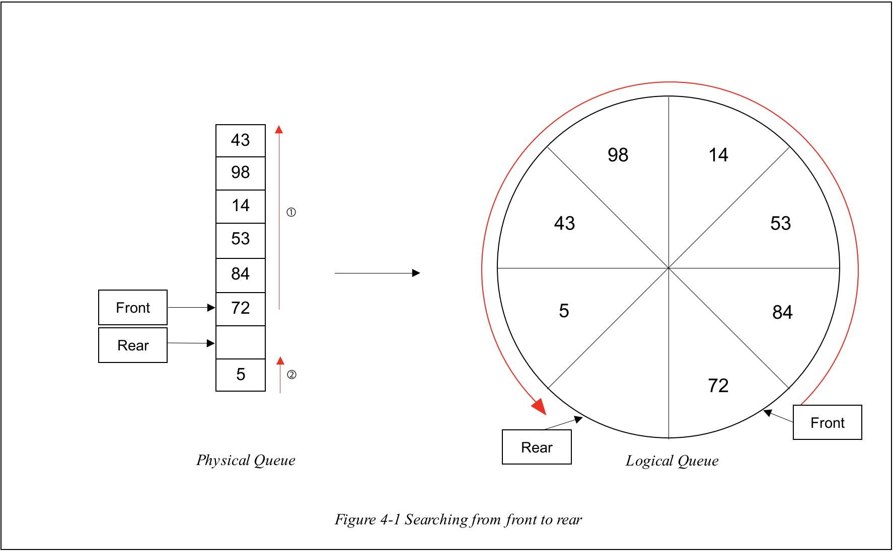

# Queue

 

# 1. Introduction

It is the data structure which is similar to **Stack** but has **FIFO(First Input, First Output)** feature.

Unlike **Stack**, putting data into Queue is called **Enqueue** and taking out data is called as **Dequeue**.

 

# 2. Ring Buffer

 

## 2-1. Problem of Queue based on Array

However, using only array to realize the **Queue** can cause the waste of space in array. Let's think about the processes of the **Queue**.
 

 

There is a Queue based on array in _Figure 2-1_. Let's assume that **Front** is the **index of first input data** and **Rear** is the **index that is supposed to be enqueued later**. Then, **The nearer a data is to Front, the earlier a data is enqueued.**

For this reason, when data is **enqueued**, **rear index is increased by 1** and a new data is enqueued. However, when data is **dequeued**, **front index is increased by 1** and previous front index's data is to be empty.

 

 

Considering these facts, executing **dequeue process on this array Queue can be a problem**. Because by the processes of Dequeue, the **spaces of array can be wasted** like _Figure 2-2_. For overcoming this situation, **ring buffer** should be introduced.

 

## 2.2 What is Ring Buffer?

Ring Buffer is a circular data structure for the problem of array **Queue** which **start index is connected with the end index**. By using **Ring Buffer**, the array Queue can be interpreted as below _Figure 2-3_.

 

 

As you can see, **Ring Buffer** is conceptional or logical data structure by connecting the start of the array and end of the array like _Figure 2-3_. It can be done by **renewing the front index or rear index value** when **they reach the start point or end point of the array**.

 

## 2-3. Renewing Index Value

 

 

Let's assume the given Queue is above _Figure 2-4_. When you try to enqueue data (in this example 28), the **rear index should be increased by 1** adding new data.

 

 

As you can see in _Figure 2-5_, the rear is **out of array** by the **increase on enqueuing process**. In order to realize the logical queue using ring buffer, what you have to do is **adjusting rear index by decreasing it by the size of array**.

 

 

**By decreasing the rear index by the size of array**, the rear index can be adjusted easily for realizing Ring Buffer Queue like _Figure 2-6_.

 

This process is same for the **front index** which is increased whenever **the data from Queue is dequeued.**

 

# 3. ADT(Abstract Data Type)

 

## 3-1. ADT of Queue

The **ADT of Queue** is as follows.

 

 

# 4. Function

 

## 4-1. void InitQueue(Queue \*q)

It is function **that initializes the queue**. It is done by **allocating array**, **setting queue's max as constant _MAX_**(defined it as 10 in header file), **setting queue's num as 0** and **setting front, rear index as 0**.

 

## 4-2. void Enqueue(Queue \*q, int data)

> **As maximum size is defined as 10 in headfile, the maximum number that you can enqueue is limited to 10.**

 

It is function that **enqueues the new data**. First, it checks **whether the number of datas in queue is less than queue's max**. When it is, the new data is **enqueued at rear index** **increasing rear index by 1**.

In this case, if **rear index is more than the max of queue**, **rear index is adjusted** as I mentioned in chapter 2. After that, the **queue's num is also increased by 1**.

 

## 4-3. void Dequeue(Queue \*q)

It is function that **dequeues the data at front index**. First, it checks **whether the number of datas in queue is more than 0**. When it is, **the data which is at front index is dequeued** **decreasing front index by 1**.

In this case, if **front index is more than the max of queue**, **front index is adjusted** as I mentioned in chapter 2. After that, the **queue's num is also decreased by 1**.

 
  
## 4-4. int  Search(Queue  *q,  int  target)

 

It is function that **searches the data which is same as input data**. Searching is **started from data at front index to data before rear index**. Whenever the **searching index is out of border of array**, it is adjusted like left side of _Figure 4-1_.

  

## 4-5. int IsEmpty(Queue \*q)

It is function that indicates **whether it is empty Queue** by **checking front index is same as rear index** and **number of datas in queue is 0**.

 

## 4-6. int IsFull(Queue \*q)

It is function that indicates **whether it is full Queue** by **checking front index is same as rear index** and **number of datas in queue is same max of queue**.

 

## 4-7. void Clear(Queue \*q)

It is function that **clears all datas in Queue** by **dequeuing until the number of datas in Queue reaches 0**.

 

## 4-8. void PrintQueue(Queue \*q)

It is function that **prints all datas in Queue**. It starts **printing from data in start index to data before rear index** moving like function **_Search_**.

 

# 5. Conclusion

It is the data structure that has **FIFO(First Input, First Output) feature** unlike **Stack**. As using only array for **Queue** can **cause problem of wasting spaces**, I introduced the **Ring Queue** which is **circular data structure** but **is realized logically by adjusting index**.

Because it is based on array, it has **the problem of limitation of maximum**. However, it can be solved by using **LinkedList**. What you have to do is just **adding pointer for front and rear** to **LinkedList!**
