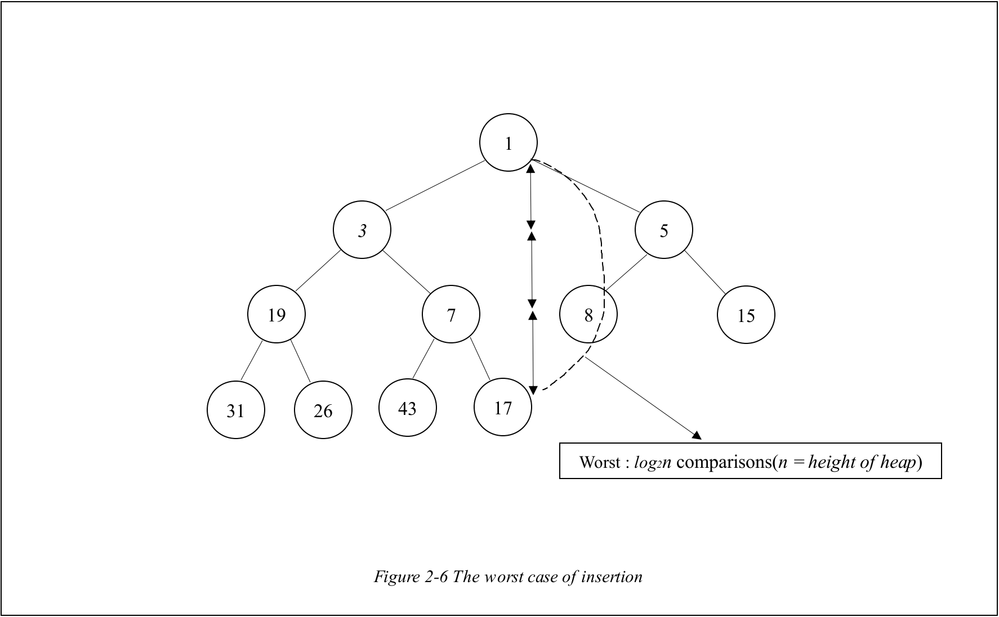
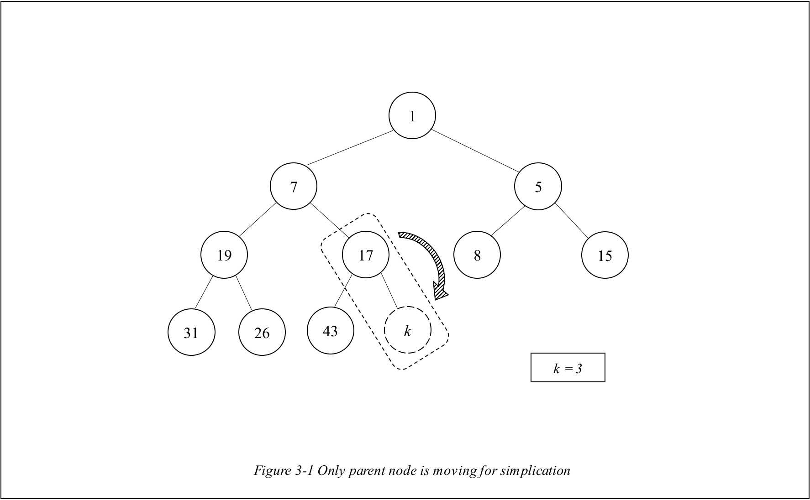

# PriorityQueue

# 1. Introduction to PriorityQueue

 

 

## 1-A. Difference with general Queue

 

 

 

The [**Queue**](https://github.com/Yangseungchan/DataStructure-based-on-C/tree/master/Queues/Queue) is the simple structure which has **FIFO**(First Input, First Output) **property**. What I try to do in this chapter is **granting outputs their priority** based on its data.

 

 

## 1-B. How can it be realized?

 

Because the PriorityQueue derives from the queue, it can also be realized by the **Array** or **LinkedList**. However, if you try to make it with them, **you must be facing fatal problems**.

 

 

## 1-C. Problems of PriorityQueue based on Array

 

 

 

If you try to **insert new data** into **PriorityQueue based on Array,** you have to **compare the new node with all other nodes** as **all nodes should be arranged based on their priority**. In the worst case, it requires **_n_ comparisons which is the length of the array** like above _Figure 1-2_. For this reason, it requires **_O(n)_** **time complexity for insertion**.

 

 

 

In the case of deletion, there is also a problem. If it is required to **dequeue a data**, **it causes movements of all other nodes to the front index**. Even though it doesn't have to be done, however, **if it is not done, it causes space waste on array**. Because **whenever the data is dequeued, the empty space at first index is created**.

 

 

## 1-D. Problems of PriorityQueue based on List

 

Even though if you **try to do realize the PriorityQueue with LinkedList,** it also **causes some fatal problems**.

 

 

 

When you try to **insert new node into PriorityQueue based on LinkedList**, **as it needs to consider the priority** of each nodes, it **requires comparisons of all nodes** in **LinkedList** in the worst case. For this reason, **insertion requires _O(n)_ time complexity.** However, **in case of deletion**, as **what you have to do is just to disconnect top priority node with next node**, it **doesn't make any problem**. The reason why **_O(n)_ becomes a problem** is that **_another method can minimize this complexity into O(log2n)!_**

 

 

## 1-E. Solution : Heap

 

 

 

To overcome these problems from **Array** and **LinkedList**, **Heap is usually introduced to realize the PriorityQueue**. **Heap** is a **Perfect Binarytree** which has a **special condition**. First of all, the **Perfect Binarytree** is a Binarytree which has **full nodes at each level except last level** and is **filled with nodes from left side** like _Figure 1-5_.

 

And the **special condition for Perfect-Binarytree to be Heap** is that **the higher priority node should be positioned at higher level** like _Figure 1-5_. In the case of the _Figure 1-5_, **the lower the data of node is, the higher the priority of node is**.

 

 

# 2. How to control and realize the Heap

 

 

## 2-A. How to Insert new node

 

 

 

The processes of Insertion is largely divided into two phases. First phase is **inserting new node next to the last node** like _Figure 2-1_.

 

 

 

After that, second phase is **adjusting the position of the new node according to its priority** by **comparing it with their parent nodes**. For example, in case of _Figure 2-2_, as the **new node's priority is higher(= new node has lower value)** than its **parent**, it should be **swapped with its parent node**.

 

 

 

 

 

 

At _Figure 2-3_, which is **after swapping each other**, the **new node should be compared with the new parent.** As the **new node has higher priority than its new parent, they also should be swapped**. After that, it is compared with new parent like _Figure 2-4_. However, in the case of _Figure 2-4_, **the new node has lower priority than its new parent, the process of swapping is not done.** Finally, the insertion process is done and make a new heap like _Figure 2-5_.

 

 

 

Unlike the previous data structures, the **heap doesn't require comparison of all nodes**. Even **in the worst case, it just requires log2n(n = height of tree) comparisons** as the worst case is **comparing new node from the lowest node to the highest node** like _Figure 2-6_.

 

 

## 2-B. How to delete the node

 

 

 

The processes of deletion are also **largely divided into two phases**. First phase is **removing the highest priority node(= root node of the heap) and replacing it with the tail node** like above _Figure 2-7_.

 

 

 

 

Second phase is **comparing the node with child node which has higher priority.** For example, as you can see in _Figure 2-8_, the root node **should be compared with left child node which has higher priority**. And then, **if it is confirmed that the child node has higher priority than its parent, then two nodes should be changed**. These processes are **repeated until there is nothing to exchange between nodes**. The _Figure 2-9_ is the heap after adjusting priorities.

 

Looking back to the procedures of the deletion in heap, there were **only some exchanges of nodes**. And **the number of exchanges are same as the height of the given tree in the worst case**. Thus the its **time complexity is evaluated as _O(log2n)_**.

 

Below table is containing time complexity of PriorityQueues which are realized by each data structure.

 

|    NAME    | Insertion | Deletion | Efficiency |
| :--------: | :-------: | :------: | :--------: |
|   Array    |   O(n)    |   O(n)   |    3rd     |
| LinkedList |   O(n)    |    1     |    2nd     |
|    Heap    | O(log2n)  | O(log2n) |    1st     |

 

 

## 2-C. How to realize the Heap.

 

 

Looking back to the previous chapters, the **Heap should be evaluated as one of the most efficient structures to realize the PriorityQueue**. If so, how can the heap be realized? **As the heap is based on the BinaryTree, the LinkedList can be regarded as the one of the easiest way** to do so.

 

 

 

However, it must be difficult if you try to do so. If you think about the processes of insertion and deletion, you have to notice that **both of them requires position of the last node** in the heap like _Figure 2-10_. In this situation, if you realized the heap as the **LinkedList**, there is no easy way to figure it out.

 

 

 

This situation can be **overcome by realizing it with the array.** As you can see in _Figure 2-11_, the **heap can be realized with the array**. When you look at the index of nodes, there are special rules between the parent node and child node. While the **left child node has index which is double of its parent's index** , the **right child node has index which is the result of adding 1 to left child node**. In sum, there is the following rule for nodes of heap.

 

- **parent index** = (left/right) **child index / 2**

- **left child** index = 2 x **parent** index

- **right child** index = 2 x **parent** index + 1

 

To hold this rule, **the index 0 should be empty**. And by **saving the number of the nodes in the heap, you can easily figure out the index of the last node** of it.

 

 
	
# 3. ADT(Abstract Data Type)

 

 

## 3-A. Defined data type

 

    typedef char HData;

    typedef int PRComp(HData d1, HData d2);

 

- Type **char** is defined as **HData** to specify that it is the **data of the heap node**.

* Second statement is the **nickname of the function which gives priority to each heap node**.

 

 

## 3-B. Structure of the PriorityQueue

 

 

 

 

 

# 3. Functions

 

 

# 3-1. Heap(.c)

 

 

## 3-1-A. void InitHeap(Heap \*hp, PRComp prc)

 

It is the function that **initializes the heap**. It sets the function pointer prc's target and initializes the numofData as 0.

 

 

## 3-1-B. int GetParentIdx(int idx)

 

It is the function that **returns the parents' index using given idx**. According to the rules of the index, **parent node's index is the result of child index divided by 2**. Input index must be index of the child node.

 

 

## 3-1-C. int GetLChildIdx(int idx)

 

It is the function that **returns the index of the left child node**. **Using the fact that left child index is double of its parent index**, it returns the left-child's index. Input index must be index of parent node.

 

 

## 3-1-D. int GetRChildIdx(int idx)

 

It is the function that **returns the index of the right child node**. **Using the fact that right child index is the result of added by 1**, it returns the right-child's index. Input index must be index of parent node.

 

 

## 3-1-E. int GetHighPrChIdx(Heap \*hp, int idx)

 

It is the function that **returns the child node's index which has higher priority between left-child and right-child node** . This function is used when deleting a heap node to adjust the priority. There are **3 conditions to distinguish some cases**.

 

### 1. left-child index is bigger than number of datas in heap.

 

This means that **there is no child node from given input node.** Because the **number of nodes in the heap represents the max index of the node**, there can be **no left-child index which is bigger than number of datas in the heap**. In this case, it **returns 0 to indicate that there is no index to return**.

 

 

### 2. left-child index is same as number of datas in heap.

 

This case represents that **only left child node exists without right child node**. In this case, it **returns the index of left-child node**.

 

 

### 3. Both of child nodes exist

 

In this case, it is **required to do comparison of priority of both child nodes**. It **uses the function-pointer in the heap to compare them**. The **value to be returned is the index of the node which has bigger priority**.

 
 
 

## 3-1-F. void HInsert(Heap \*hp, HData data)

 

It is the function that **inserts new node into heap**. The **childidx** is assumed as containing **the index of position to be inserted**. And the **parentidx** is containing the **index of parent of the node** at **childidx**.

 

 

 

After that, **only if the number of datas in heap is more than 1**, **adjustment of priority should be done**. Because it is not necessary to be adjusted if the inserted node is the first node to be inserted. In the process of adjustment, similar to the **chapter 2-A**, the **exchanges between inserted node and other nodes should be done theoretically** like _Figure 2-2_.

 

 

 

 

However, **to reduce the unnecessary movements** , **only movement from parentidx to childidx is executed**. For example in _Figure 3-1_, node which has 17 moves alone to its child node. After that, like _Figure 3-2_, for **further adjustment of priority**, parent node compares its data with the new inserted node's data which doesn't exist as a node physically.

 

 

 

After adjustments of priority is done, **finally, the new inserted node's data is moved to its position**. Consequently, **the unnecessary movements of new inserted data is not done for it s efficiency** by skipping its movement. After **adding the number of datas by 1** in PriorityQueue, **the Insertion process is finished**.

 

 

## 3-1-G. HData HDelete(Heap \*hp)

 

 

 

It is the function that **deletes a node which has the highest priority in the heap**. Before removing the root node, **its data should be saved to return it**. After that, the **change of data from tail node to its root node** like _Figure 2-7_ is **not executed on the code** for reducing unnecessary movements.

 

 

 

 

 

To **adjust the priority in the Heap**, the **comparisons of datas between parent and its child should be done**. However, **in actual code, the data at tail node is compared with the child node's data instead of their parent node** as the **moving to root node has not actually happened** like _Figure 3-4_. **After finishing adjustments of priority** like _Figure 3-5_, by **decreasing the number of datas in the heap**, the **tail node is removed and deletion is completed**.

 

 

## 3-1-H. void PrintHeap(const Heap \*hp)

 

It is the function that **prints the datas of the heap in the order of the array**.

 

 

# 3-2. PriorityQueue(.c)

 

 

## 3-2-A. int compPR(HData d1, HData d2)

 

It is the function that **produces priority comparing two HDatas** for **giving priority between two nodes**. Based on given two inputs, **if d1 has lower value data than d2** then it **returns 1 which it means d1 has higher priority than d2**. On the contrary**, if d2 has lower value than d1**, then it **returns 0 which means d1 has lower priority than d2.**

 

 

## 3-2-B. void InitPrQ(PrQueue \*q)

 

It is the function that **initializes Priority Queue by using function InitHeap in Heap.c**

 

 

## 3-2-C. void Enqueue(PrQueue \*q, HData data)

 

It is the function that **enqueues data into PriorityQueue by using function HInsert in Heap.c**.

 

 

## 3-2-D. HData Dequeue(PrQueue \*q)

 

It is the function that **dequeues data from PriorityQueue by using function HDelete in Heap.c**. It **returns data which came from HDelete**.

 

 

## 3-2-E. void PrintPrQ(PrQueue \*q)

 

It is the function that **prints the priority queue by using PrintHeap in Heap.c.**

 

 

## 3-2-F. int IsEmpty(PrQueue \*q)

 

It is the function that **indicates whether the queue is empty** . It **checks emptiness by checking numofData in the heap**.

 

 

## 3-2-G. int IsFull(PrQueue \*q)

 

It is the function that **indicates whether the queue is full**. It **checks fullness by checking numofData in the heap**.

 

 

## 3-2-H. void Clear(PrQueue \*q)

 

It is the function that **clears all datas and itself.** It **dequeues all datas in the Priority Queue** until there is any node in the heap.

 

 

# 4. Conclusion

 

 

It is the queue that gives all nodes their priority to give specific orders in dequeueing nodes. For realizing it, it requires understanding of Heap which is based on Perfect-BinaryTree. If you understand the structures of Heap related with Perfect-BinaryTree and Array, it is not that difficult structure for you to understand it
