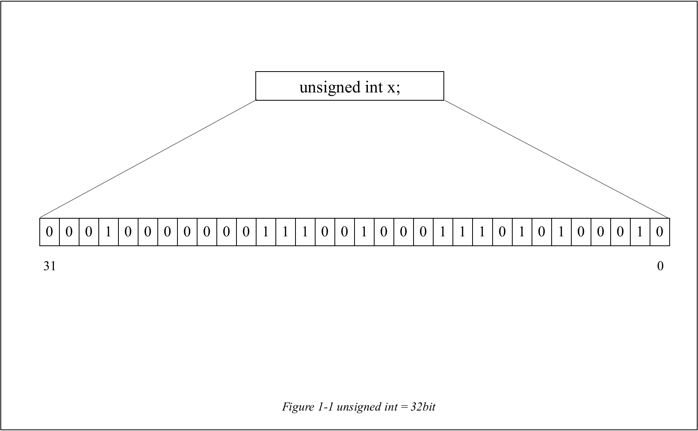

# BitSet

# 1. Introduction

 

## 1-A. Bit based on unsigned int

 

It is the **Set that based on the Bit of unsigned integer**. As **unsigned integer** is **4Byte** size data structure, it can contain 32 bits on it. Using these 32bits, it can describe numbers **from 0 to 31** like _Figure 1-1_.

 

## 1-B. Bit that describes a Set

 

 

As you can see in _Figure 1-2_, the **Bit in unsigned int** can be described as a Set. Each **1 bit** is the number in the Set.

 

# 2. ADT(Abstract Data Type)

 

> **unsigned int** is re-defined as **BitSet**
>
> **BitSetNull** indicates **the set which has only 0 bits**.
>
> **BitSetNum** is the constant that **contains the number of bits in BitSet**.

 

# 3. Function

 

## 3-1. SetOf(no) ((BitSet)1 << no)

 

It is a macro function that converts input integer number as BitSet by **using bit left shift operator**.

 

## 3-2. int IsMember(BitSet s, int n)

 

It is the function that checks **whether n is a member of BitSet s.** It can be checked by using **AND bit** operator **between BitSet s and SetOf(n)** .

 

 

If integer **n is a member of BitSet s**, then it **returns SetOf(n)** like _Figure 3-1-1_.

 

 

If integer **n is not member of BitSet s**, then it **returns SetOf(0)** like _Figure 3-1-2_.

 

## 3-3. void Add(BitSet \*s, int n)

It is function that adds n to BitSet s. It can be done by **using OR bit operator**. **Bit OR operator** can make result bit as **1 if at least one of two bits is 1**.

 

 

For example, when you try to add 8 to BitSet s, it can be done by using OR operator with SetOf(8). As **8th bit in SetOf(8) is 1**, the **result bit also becomes 1** like _Figure 3-2-1_.

 

## 3-4. void Remove(BitSet \*s, int n)

It is the function that **removes n from BitSet s**. It can be done by using bit operator **AND** and **NOT**. **NOT operator** is **exchanging 1bit with 0bit (or 0bit with 1bit)**.

 

 

By **taking NOT operator on SetOf(8)**, every bit in SetOf(8) becomes 1 except the 8th bit. After that, **taking AND operator s with ~SetOf(8)** can **remove 1bit at 8th bit from BitSet s** like _Figure 3-3._

## 3-5. int Size(BitSet s)

It is the function that **returns the size of BitSet s**. It can be done **by using AND operator**.

 

 

Before using **AND operator**, you need to to make **BitSet s-1**. After that, you have to **take AND operator s with s-1**. By doing so, you can **remove rightmost 1 bit in BitSet s** like _Figure 3-4-1_ and _Figure 3-4-2_. It is done until s is not 0. While you are doing so, **you have to count how many AND operators have been taken**.

 

## 3-6. void Print(BitSet s)

 

It is function that **prints the datas of BitSet in form of ordinary Set**. By comparing all bits in BitSet using function IsMember, it prints the data if IsMember returns positive integer.

 

## 3-7. void Println(BitSet s)

It is the function that **prints the BitSet s using function Print and prints new line**.

 

# 4. Conclusion

 

By using bit operator and unsigned integer, it can express the Set simply. However, as it uses the unsigned integer, it can only express the integer from 0 to 31.
