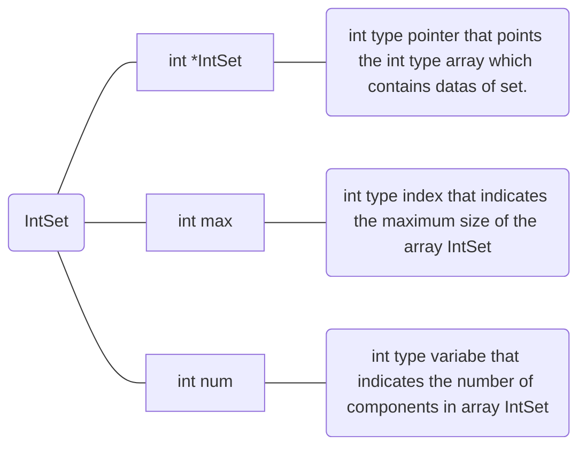

# IntSet

# 1. Introduction

 

It is **Set** that contains **integer datas in array**. The Set has **two special conditions**.

 

1. **Order of datas are not concerned**.
2. There is **no same data** in array.

Based on them, there are basic calculations for **Set** which is **somehow different from general calculations**.

 

## 1-A. Basic Conception of IntSet

 

 

As you can see in above _Figure 1-1_, the Sets can be described with two arrays. Based on **two special conditions**, each array **can't contain any same data** and **doesn't concern any order in array**.

 

## 1-B. Union

 

 

As you can see in _Figure 1-2_, **Union calculation** can be interpreted as **the sum of two different sets** .

 

## 1-C. Difference

 

 

As you can see in _Figure 1-3_, **Difference calculation** can be interpreted as the **subtraction of two sets**.

 

## 1-D. Intersection

 

 

As you can see in _Figure 1-4_, **Intersection calculation** can be interpreted as the **common components of two sets**.

 

# 2. ADT(Abstract Data Type)

 

## 2-1. ADT of IntSet

 

 

# 3. Function

 

## 3-1. void InitSet(IntSet \*s, int max)

 

It is the function that **initializes the IntSet**. **s->max** is set as **input max**, **s->num** is set as **0** for indicating **there is no data in IntSet s**. And IntSet is allocated for **max** x **sizeof(int).**

 

## 3-2. int IsMember(const IntSet \*s, int n)

 

It is the function that **indicates whether the number is member of IntSet s**. By searching through all components in array IntSet, if it finds **integer which is same with n**, it **returns the index of it**. If not so, it **returns _FALSE_** which is defined in header file as _-1_.

 

## 3-3. void Add(IntSet \*s, int n)

 

 

It is function that **adds number n to IntSet s**. If it is checked that **s->num is less than s->max**, then also checks whether **n is the member of IntSet s**. If so then **number n is added at index s->num** while **s->num is increased by 1**.

 

## 3-4. void Remove(IntSet \*s, int n)

 

 

It is the function that **removes number in IntSet s**. First it checks **whether IntSet s has at least one member**. If so, then **it also checks whehter the number n exists in IntSet s**.
If all of these are checked, then removal is gonna be done. When removal is done, **empty space is filled with the last component** like _Figure 1-6_. If **s->num is only 1,** then **it just removes the target component**.

 

## 3-5. int Size(IntSet \*s)

It is the function that **returns number of components in IntSet s(s->num)**.

 

## 3-6. int Capacity(IntSet \*s)

It is the function that **returns capacity of IntSet s(s->max)**.

 

## 3-7. void Assign(IntSet *s1, const IntSet *s2)

 

It is the function that **assigns all components in s2 to s1**. It is like **copying all components of s2 to s1**. However, it depends on **s1->max**. If **s1->max is less than s2->num** then, **s1->num is set to s1->max** which means that **only s1->max of s2->num components are assigned to IntSet s1**.

 

## 3-8. int Equal(const IntSet *s1, const IntSet *s2)

It is the function that **indicates whether these two IntSets are equal or not**. First, it checks **s1->num and s2->num are same**. If they are **considered to be same**, then it **compares all components for checking the sameness**.

 

## 3-9. void Union(IntSet *s1, const IntSet *s2, const IntSet \*s3)

It is the function that makes **Union set of s2 and s3**(like _chapter 1-B_) and returns the result to **s1**.

 

 

As you can see in _Figure 3-4_, at first, function **Union assigns s2 to s1** like **yellow part**. And then, **green part is added** by **adding s3 which is not in s1**.

 
  
## 3-10. void  Difference(IntSet  *s1,  const  IntSet  *s2,  const  IntSet  *s3)

It is the function that makes **difference set of s2 and s3**(_like chapter 1-C_) and returns it to s1.

 

 

As you can see in _Figure 3-5_, the difference is making **a set which is s2 but not s3**. It is started by **assigning s2 to s1**. After that **by removing s3's member which are also member of s2**, the difference is done.

 

## 3-11. void Intersection(IntSet *s1, const IntSet *s2, const IntSet \*s3)

It is the function that **makes intersecting set of s2 and s3**(_like chapter 1-D_) and returns it to s1.

 

 

As you can see in _Figure 3-6_, it is finding the set **which is not only s2 but also s3**. By **adding s3 members to s1** which **are also s2 members**, it can be done.

 

## 3-12. void PrintSet(const IntSet \*s)

It is the function that **prints all number in IntSet s in form of {1,2,3}**.

 

## 3-13. void ClearSet(IntSet \*s)

It is function that clears all numbers in IntSet s and setting max and num as 0.

 

# 4. Conclusion

 

It is the **Set based on array**. By using the feature of array, the **basic calculations** of Set can be realized.
