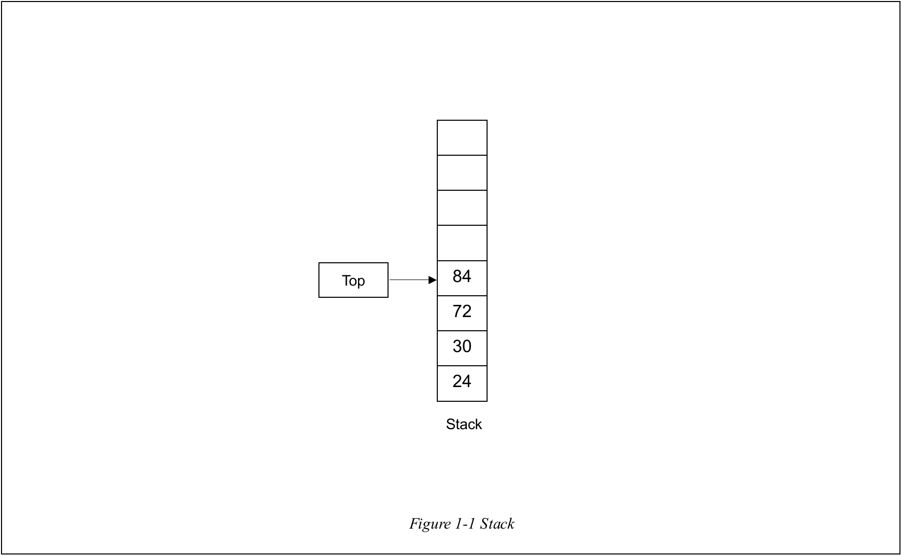
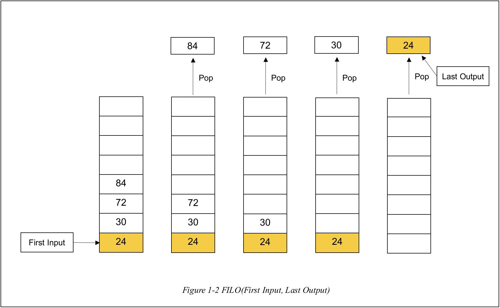
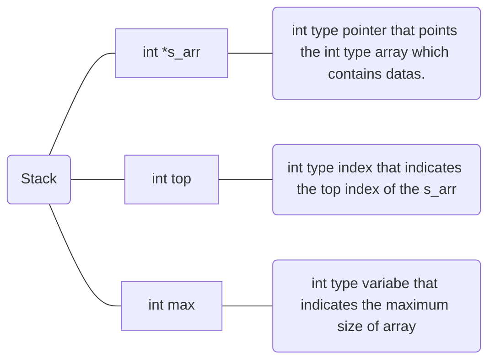
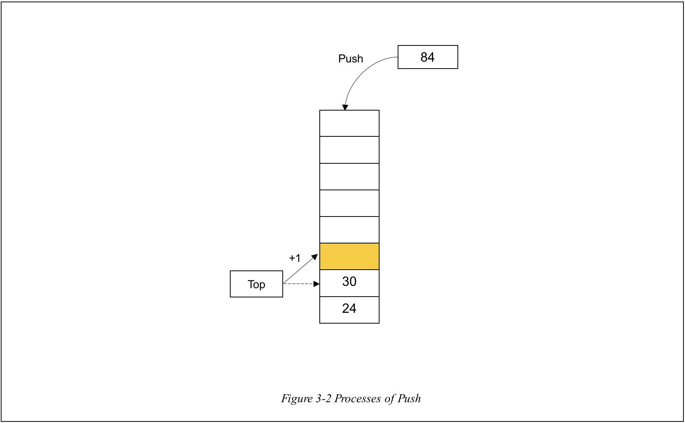
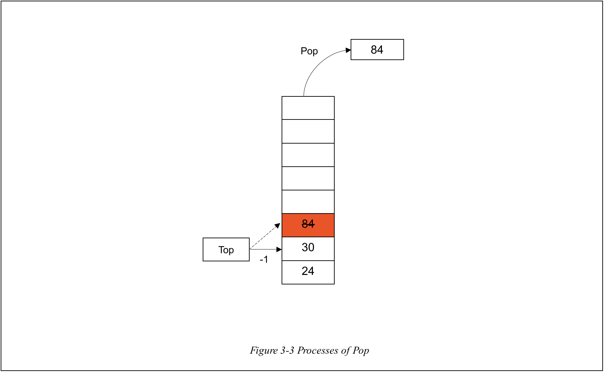
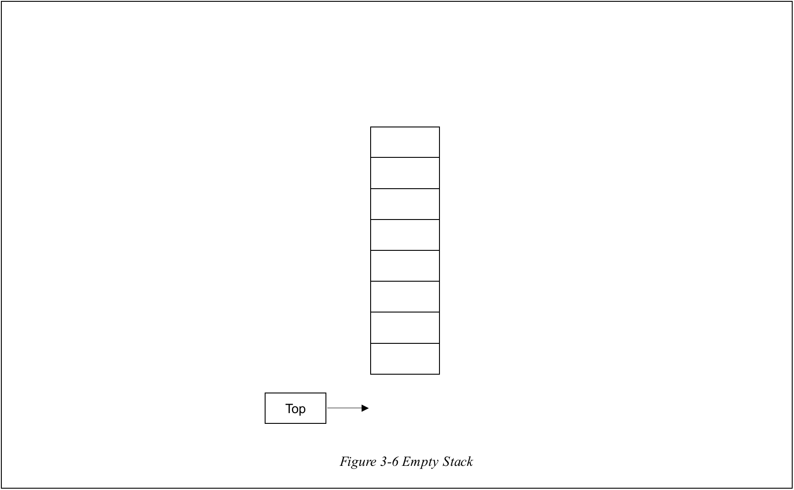
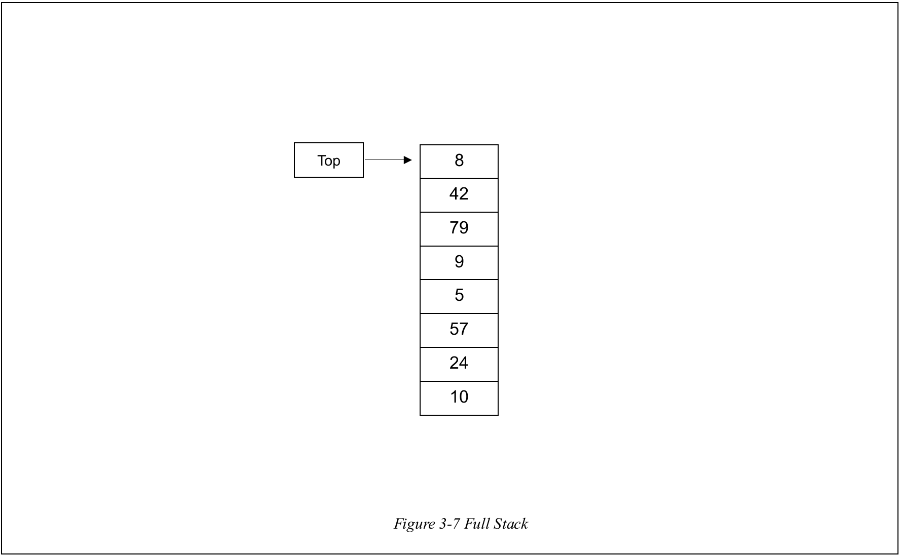

# Stack

# 1. Introduction

## 1-A What is Stack?

What the word **Stack** means is as follows.

> **Stack** : To put things in a neat pile.
>
> _From Cambridge English Dictionary_

 

 

According to the meaning of the **Stack**, data structure **Stack** is a pile of datas like _Figure 1-1_.

## 1-B Basic characteristic of Stack

**Stack's entrance and exit is on the only one way.** By this characteristic, **the earlier the data is pushed, the later the data is popped.** This feature is usually called as **FILO(First Input, Last Output)** like above _Figure 1-2_.

 

> In **Stack**, inputing data is called as **Push** and taking out data is called as **Pop**.

# 2. ADT(Abstract Data Type)

## 2-1. ADT of Stack

The ADT of Stack is as follows.

# 3. Functions

 

## 3-1. void InitStack(Stack \*stk)

It is the function that initializes the **Stack**. First, it allocates **s_arr** in **Stack**. After that, all components of arrays are assigned as _-1_. And stack's **max** is assigned it as MAX(defined as _500_ in header file) and stack's **top** is assigned as _-1_ for **indicating that stack contains nothing.**

 

## 3-2. void Push(Stack \*stk, int num)

By using function **IsFull**, it checks whether **Stack is full**. Only if not, push is done. While index top is added by _1_, top index's component is assigned input num like _Figure 3-2_

  

## 3-3. void Pop(Stack \*stk)

Unlike **Push**, it checks emptiness of **Stack** by using function **IsEmpty**. Only if **Stack** is **not empty**, top component is popped from **Stack**. After that **top** index is **decreased by 1**.

 
  
## 3-4. void  Peek(Stack  *stk);

It is the function that **prints the top index's component** in **Stack**. It is done only if **Stack is not empty**. It is checked by using function **IsEmpty**.

  

## 3-5. void PrintStack(Stack \*stk)

It is the function that **prints whole components** of stack.

 

## 3-6. int IsEmpty(Stack \*stk);

It is the function that **checks whether the Stack is empty**. It checks using the fact that **empty stack is possible** only if the **top index is or smaller than** _-1_.

 

## 3-7. int IsFull(Stack \*stk);

It is the function that **checks whether the Stack is full**. It checks using the fact that full stack is possible only if the **top index** is **smaller than** the number of **stack's max minus one**.

 
  
## 3-8. int  Search(Stack  *stk,  int  num); 
It is the  function that finds the input number in stack

## 3-9. void Clear(Stack \*stk);

It is function that clears all components in stack **by popping all components until stack is empty**.

# 4. Conclusion

Stack is one of the most simple data structures. As it is **FILO(First Input Last Output)**, it can save the order of input. Conversely, what is the data structure for **FIFO**?
