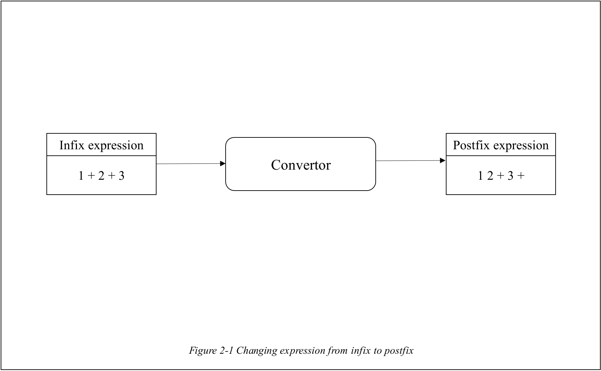
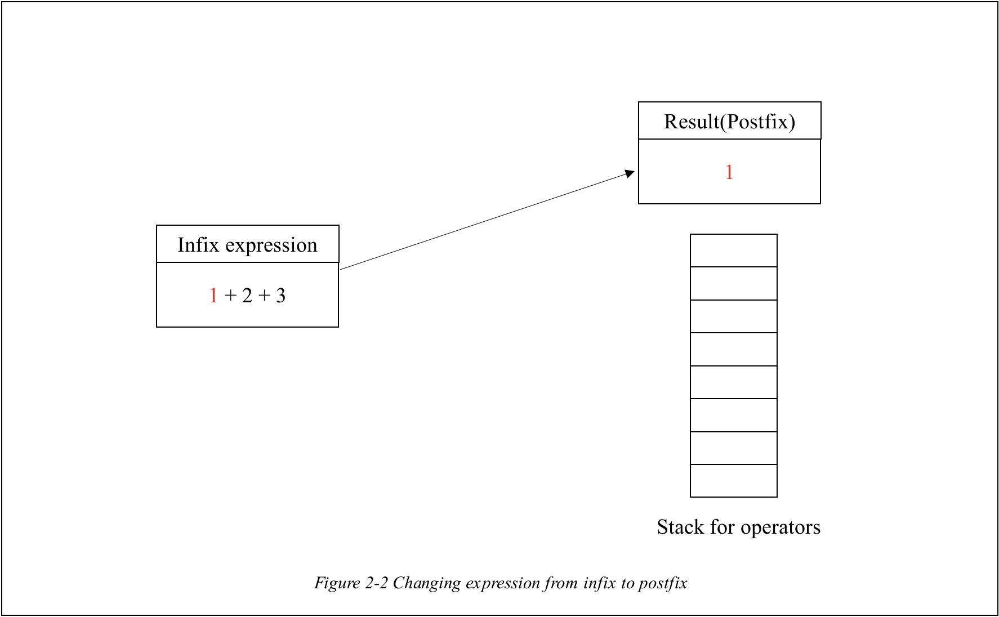
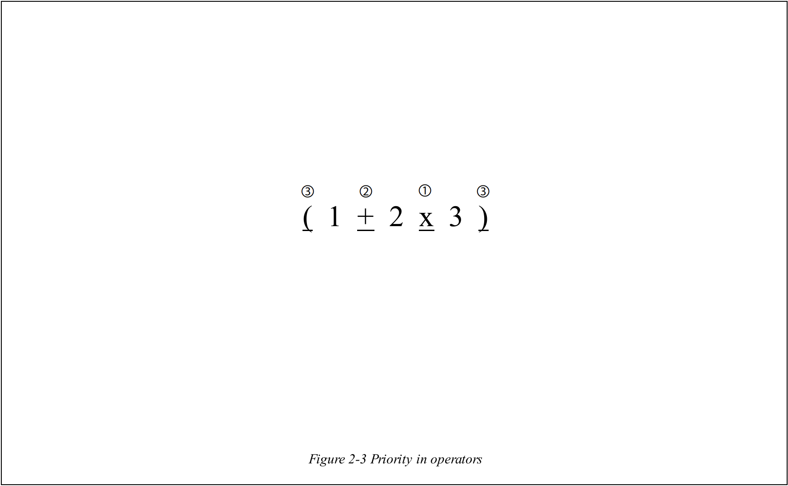
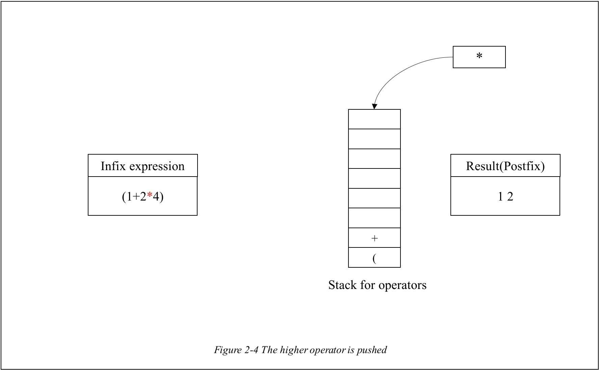
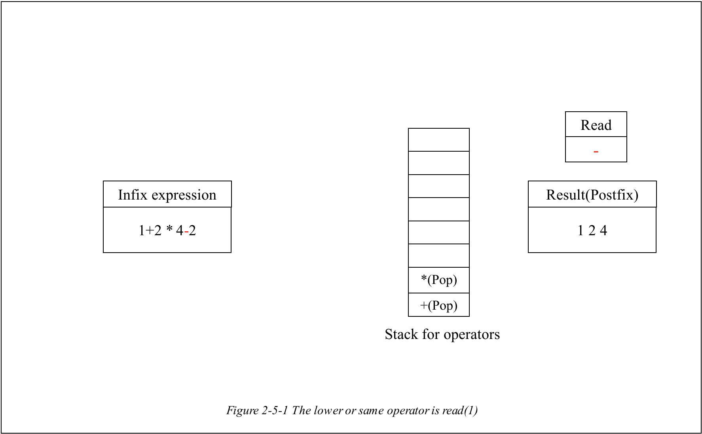
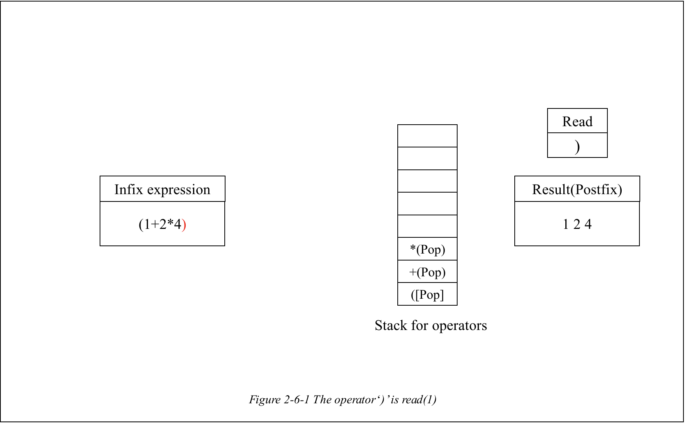
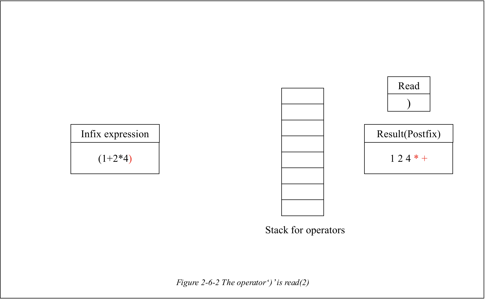

# ExpressionConvertor

 

 

# 1. Understanding of Expression

 

 

## 1-A. Infix? Postfix? Prefix?

 

**Infix** is the general expression that we are using usually, **which has an operator between two operands** like '1 + 2, 3 x 5'.

 

**Postfix** is the a different expression with Infix **which has an operator behind two operands** like '1 2 +, 3 5 x'. These two examples are same expression with two examples in **Infix**.

 

**Prefix** is the another method to express an expression **which has an operator in front of two operands** like '+ 1 2', 'x 3 5'. These two examples are also same with other methods' examples.

 

## 1-B. Convertor from Infix to Postfix.

 

What I gonna introduce, in this chapter, is **a convertor from Infix expression to Postfix expression for making the next expression tree using BinarySearchTree**.

 

As I mentioned, what this chapter does is just **to convert the expression not calculate given expression**.

 

 

# 2. How to change the given expression from infix to postfix

 

 

 

If the **infix expression** is given as an input, then the **convertor** has to change it to the **postfix expression** like above _Figure 2-1_. In order to do so, there are **different steps in processing the operands and operators**.

 

 

## 2-1. Processing the operands

 

 

**Processing the operands** is somehow simple. What you have to do is just to **move the operands** to the **result expression(post-fix)** like _Figure 2-2_. That's because **the operands are always positioned in front of the any operands**(consider that this expression is **postfix**).

 

 

## 2-2. Processing the operators

 

 

Unlike the **operands**, the **operators** have something to be considered. Each of **operators** has **different priority** not only in **infix** but also in **postfix**. As you know, the operators for multiplication and division has higher priority than the operators for **addition** and **subtraction**. Furthermore, the operators **'('** and **')'** are the lower than other operators as you can check in above _Figure 2-3_.

 

And also it needs to be **written behind their operands**, as the result expression should be **postfix**.

 

For these reasons, the operators should be processed with **the following special rules**.

 

[For **+, -, x, /** operators]

1. If operators are read, **all operators are supposed to be pushed** to stack **except the special cases**.

 

 

 

2. If the operators **which have higher priority** than the **top of operator stack** are read like _Figure 2-4_, then it is pushed for being at first on result expression.

 

 

 

 

3. If the operators **which have same priority with or lower priority** than **the top of the operator stack** are read like above those two figures, then all of the operators **which were pushed at operator stack(= have higher than or same priority with it)** are supposed to be **popped** except **'(' operator** **until the lower or same operator is read**.

 

 

[For **'('** operator]

1. The operator **'('** is considered as the **lowest operator**.

2. The operator **'('** which is considered as the lowest operator should be remained at stack until the operator '**)**' is read.

 

 

 

 

 

[For **')'** operator]

1. Even though the operator **')'** is read, it is **not pushed into operator stack** like _Figure 2-6-2_. It's just used for being read.

2. If operator ')' is read, **all other operators which is above of the operator '('** are **popped** from stack and reflected into result like _Figure 2-6-1_ and _Figure 2-6-2_.

 

 

# 3. ADT of ExpressionConvertor

 

 

## 3-A. CharStack

It is the **Stack that is almost same with what I've done previously**. But there is a little difference between them. **CharStack**, as you can see in this name, **its data type** is the **char**. That's all.

 

 

# 4. Functions

 

 

## 4-1. int opPriority(char op);

 

It is the function that gives operators their priority. As I explained, because the **operators for multiplication and division are highest** among other operators, they are given **the highest priority(return 5)**.

And the **operators for addition and subtraction** are given **second priority(return 3)** as they are **lower than** multiplication and division but **higher than** **parenthesis**.

Finally the **operators for parenthesis** are given **lowest priority(return 1)**.

 

 

## 4-2. int compPriority(char op1, char op2);

 

It is the function that **compares the two operators op1 and op2** considering the priority given by the function **opPriority**. The priority value which is given by it is compared.

 

 

## 4-3. void convertExpression(char expression[], int length)

 

It is the function that **converts the expression from infix to postfix**.

Based on the given **input expression**, it reads the all components of it. If it reads an **operand**, then it is directly **reflected into result array** as I mentioned in _Chapter 2-1_.

Otherwise, **all of them(operators)** are processed according to the rule which is mentioned at _Chapter 2-2_.

When you see the part that processes the expression, you can see this code.

 

    if(result[idx] != ' ') {

       result[idx++] = ' ';
    }

 

This code is used to make the result array **easier to read** with the space **between the operands and operators**.

 
