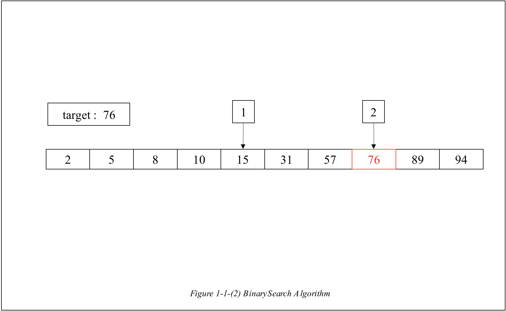
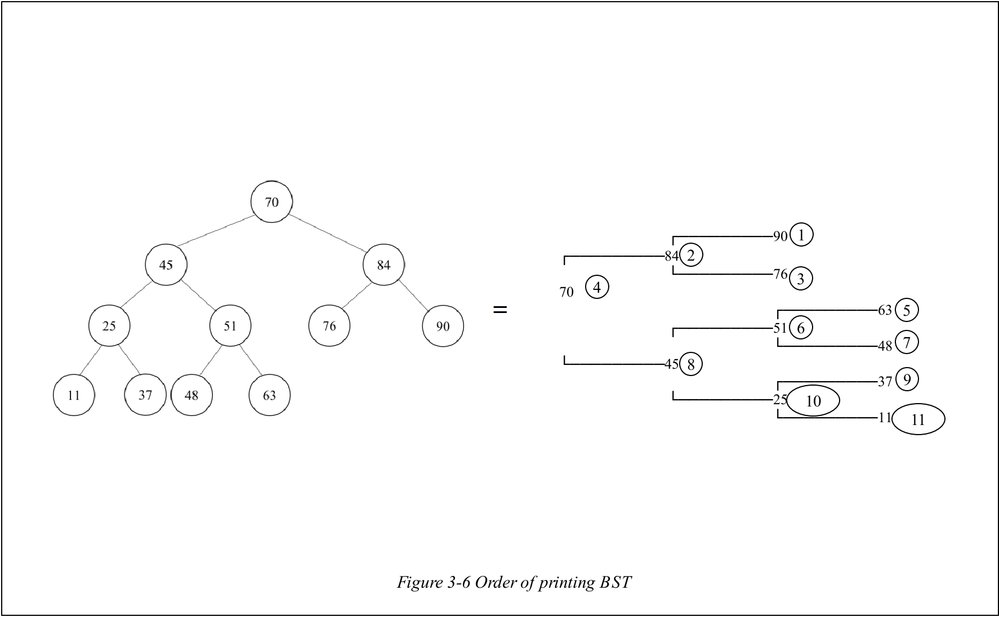

# BinarySearchTree

 

# 1. Introduction

 

It is the one of the tree that **can find the elements in tree** based on **BinarySearch Algorithm**.

 

## 1-A. BinarySearch Algorithm

 

It is one of the **efficient algorithms to find an element** in tree, array or anything else. This algorithm compares the middle element with the target until it finds the target.Let's assume an array like below _Figure 1-1-1_. Also, let's assume the number that you want to find is 76.

 

In this example, the **first index** of array is **0** and the **last index** of it is **9**. The **middle index** which is **sum of first and last index divided by two** is **4**. So the middle element in array is 15. When it compares them, **target is larger** than middle index. In this case, the **first index is changed to middle index + 1**. Otherwise, **when the target is smaller,** **the last index is changed to middle index - 1**.

 

 

Using this process, the target is found at second trial like _Figure 1-1-2_. The points of this algorithm are **(1) comparing the target with middle number** and **(2) updating the middle number until it finds the target**.

 

## 1-B. Basic Features of BST

 

 

 

As I mentioned, the **BST** is a tree based on **BinarySearch Algorithm**. For this reason, the BST has an appearance like above _Figure 1-2-(1)_. As you can see in _Figure 1-2-(1)_, each numbers in tree are inserted based on **BinarySearch Algorithm**. For example, **47** is compared with **70, 45 and 51** to be inserted. By results of them, **47** is inserted at **left of the 51** like _Figure 2-1-(2)_.

 

# 2. ADT(Abstract Data Type)

 

## 2-1. ADT of BinNode

 

 

## 2-2. ADT of BST

> **BST** is the **collection of the BinNodes** connected by **the rule of BinarySearch**.

 

# 3. Function

 

## 3-1. BinNode \*AllocNode()

 

It is the function that **allocates new BinNode** and **returns allocated BinNode**.

 

## 3-2. void SetBinNode(BinNode *nde, const int data, BinNode *left, BinNode \*right)

 

It is function that **sets the datas of BinNode**. Using given inputs, it sets the **data, left BinNode and right BinNode** of **BinNode nde**.

 

## 3-3. BinNode *Search(BinNode *p, const int data)

It is the function that **searches the input data in BST**. As the BST is based on the BinarySearch algorithm, the searching algorithm in this function is also **binary search** like _Figure 1-1-(2)_.

 

## 3-4. BinNode *Add(BinNode *p, int data)

 

It is the function that adds the new data to BST. The input **BinNode p** is the **root** of the BST and input **int data** is the data **to be inserted to the BST**. Before starting insertion, it prepares BinNode to be inserted by using function **AllocNode** and **SetBinNode** to make the **BinNode nde**. And in this function, the BinNode type pointer **parent** is the BinNode which is **parent of newly inserted BinNode**.

If the **temp(=root) is NULL**, then the **new node becomes the root of BST**. Else, the function should **find its parent of the new node**. The following explanation is about inserting new node into BST not into root.

 

 

Let's assume that the input data is 49. Then the initial situation would be like _Figure 3-1-1_. Then it starts to compare the **nde** with **temp**. As it is **smaller than temp**, the node temp is **moved to left to the temp** and **parent becomes previous temp** node to **save the position of parent** like below _Figure 3-1-2_.

 

 

While **temp becomes _NULL_** which means that **it finds the position of nde**, temp and nde is compared and **temp, parent is changed**. After it finds that **temp is _NULL_**, then **it compares the parent's data with nde**. If **nde is smaller**, then it is **assigned to left child of the parent node**. Otherwise, it is assigned to the **right child of the parent** node like below _Figure 3-1-3_.

  

 

It is ended after **returning the node p** which is the **root of the BST added with newly inserted node**.

 

## 3-5. int Remove(BinNode \*\*root, int data)

 

It is the function that **removes the node which has same data with input data**.

 

### 3-5-A. Why input root node is given as double pointer?

 

As you see the inputs of this function, you can notice that the BinNode pointer is **BinNode type double pointer**. As there can be case **when the root of the BST should be removed**.

 

 

Let's imagine the input is **just the BinNode type pointer** like above _Figure 3-2-1_. Then, there will be a **copied pointer of root pointer(red)** which **points the root node of BST** because **the input BinNode(red) of this function is copied from ordinary root pointer as it is input of function Remove**.

 

    root = NULL;

 

For this reason, when you try to remove the **root node of BST with above code**, it is impossible to do so. To overcome this situation, the input node is given as double pointer.

 

 

As input double pointer is given that **points the pointer of BST root** like above _Figure 3-2-2_. Using feature of double pointer, it can remove root node of BST using following code.

 

    *root = NULL;

 
 

### 3-5-B. Finding the target node

 

Before it starts to remove the node, it **searches the target node** to be deleted, **by comparing datas and moving target and parent node**. However, unlike function **add**, this searching is done until **not only target is not NULL but also the target's data is not same with input data**.

 

while searching the target node, it records **whether the target node is left child or right child of the parent node** for the next remove processes. After this process, if **target is decided to be NULL which means it fails to remove**, then it **returns _-1_**. However, it finds the target, **the removal process is divided into 3 cases**.

 

### 3-5-C. Case 1 : Target node has no child

 

 

If the **target node has no child** like above _Figure 3-3-1_, what you have to do is just **cutting the connection between the parent node and target node**. If the **target node is root node**, as I mentioned previously, using the feature of double pointer, you have to make **the root node's address as _NULL_**.

 

### 3-5-D. Case 2 : Target node has one child

 

 

 

It is the case when **the target has only one child** like above _Figure 3-3-2_. In this case, what you have to do is to **disconnect target with parent** and **connect the parent with child node** like _Figure 3-3-3_.

 

 

 

But what happened **if the target is the root with only one child** like _Figure 3-3-4_? In this case, you just **adjust the root pointer's address to the child node** using **double pointer calculation** like _Figure 3-3-5_.

 

### 3-5-E. Case 3 : Target node has two children

 

 

 

It is the case, when the **target has two children** like _Figure 3-4-1_. What you have to do in this case is t**o replace target node with child node**. In this case, the child node is **one of the biggest node in left subtree of target node** like _Figure 3-4-2_.

 

 

However, unlike _Figure 3-4-2_, there can be a case **when child has its left child(because child is the biggest nodes in left subtree)** like _Figure 3-4-3_. In this case, what you have to do is **connecting child's child with child_parent node** after replacing target node.

 

When **target is root**, it is not different case. Because the target is **not to be deleted but to be replaced** with other node.

 

## 3-6. void PrintBST(BinNode \*p)

 

 

It is the function that **prints the BST in 2 dimensional form** like above _Figure 3-5_. It uses the recursive function **PrintTree**.

  

## 3-7. void PrintTree(BinNode \*nde, int level, int direction)

 

It is function that prints the BST in 2 dimension like _Figure 3-5_. It prints the BST moving through by **In-order traversal(1. right sub tree -> 2. root node -> 3. left sub tree)**.

 

 

Therefore, the **order of the printing BST** would be like above _Figure 3-6_. The **long empty space** is printed for **level -1 times**. After that, '**┌─────────**' or '**└─────────**' is printed depending on whether the node is **right child** or **left child** of its parent.

   

## 3-8. void FreeTree(BinNode \*\*p)

 

It is function that frees the all nodes in BST by using function Remove until p becomes NULL.

 

# 4. Conclusion

 

## 4-1. Summary

 

It is the tree using **binary search for inserting, removing and searching a node**. By using it, you can **manage datas more effective**.

 

## 4-2. Fatal Defect

 

 

However, if nodes are inserted like _Figure 4-1_, the BST can be considered **inefficient**. For this situation, it is required **balancing**.
