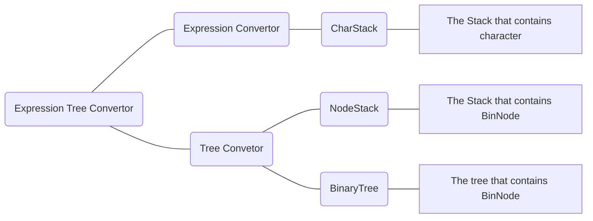

# ExpressionTree

# 1. Expression Tree

 

 

## 1-A. What is Expression Tree?

 

The expression tree is a **BinaryTree** that **contains all operands and operators** of an expression. Let's assume that there is an expression "**1+2\*7**". Then this expression can be converted into the following **BinaryTree**.

 

 

As you can see in above _Figure 1-1_, **one operand node** is surrounded with **child nodes that contain an operand or an operator**. If so, how can this expression tree calculate the result? In case of the expression tree, **the higher the level of the operator node, the faster it is calculated**. On this expression tree, **as the level of the multiplication operator between 2 and 7 is highest**, it is calculated at the **first time**. As a result, the tree is converted into following tree in _Figure 1-2_.

 

 

 

After that, **the same process** is also applied to **other remaining nodes**. As a result, the **total calculation value is evaluated as 1+14 = 15**. As you can see them, using expression tree is an easy job. However, the difficulty in expression tree comes from **making tree based on expression**.

 

 

## 1-B. How to convert expression to ExpressionTree?

 

If we are given infix expression, how can we change it as an expression tree? Before doing it, the **change from infix expression to postfix expression is required**.

 

What changes it to postfix expression is [Expression Convertor](https://github.com/Yangseungchan/DataStructure-based-on-C/tree/master/Stacks/ExpressionConvertor) which has been done in chapter **Stacks**. By changing to **postfix expression**, it can be easier for system to **convert expression to expression tree**.

 

After that, it's now ready to change postfix expression into expression tree. For this process, the two data structures are required. One is **Binary Tree** which is **needed for visualizing expression tree**. This is the changed version of [Binary Search Tree](https://github.com/Yangseungchan/DataStructure-based-on-C/tree/master/Tree/BST) which **has no searching function**. The second data structure is **Stack that contains nodes which are same nodes in Binary Tree** for **inserting nodes into Binary Tree**. How can be done with these two data structures?

 

 

 

Let's build an expression tree with **postfix expression** such as **"7 4 2 \* + 1 -"** which came from **infix expression** **"7+4\*2-1"**.

 
  
Unlike the convertor from infix to postfix, **the operands are pushed into stack** like above **#1** in *Figure 1-2-1* . However, when **an operator is read**, the operator **becomes the root node** of the subtree. And **the two nodes**(mostly operands but sometimes operators) **which were pushed previously** are **popped for making an expression as a pair of one operator with two operands** like above **#2-1 ~ #2-2** in _Figure 1-2-1_.

 

What you can notice is that the **first popped operand becomes right child** of the operator and the **second popped one becomes left child of the operator** which is for **making them in the order of calculation**. Once the subtree which has three nodes is made, the **root node of the subtree is supposed to be pushed into stack**.

 

 

 

 

Likewise, if the operator is read, then the **two nodes which had been pushed is popped to create the subtree** like above _Figure 1-2-2_. Then **the newly made subtree is pushed into Stack**. These processes are **repeated until there is nothing to read from given postfix expression**. After the processes are done, finally, the finshed expression tree is created like _Figure 1-2-3_.

 

 

 

To sum up those things, it can be summarized as above _Figure 1-3_.

 

 

# 2. ADT(Abstract Data Type)

 

 

## 2-1. DataStructures for Expression Tree Convertor

 

 

 

## 2-2. Source codes' flows of ExpressionTree

 

 

As I mentioned, **for converting given expression into expression tree**, it is needed to convert it to **postfix expression**. The ExpressionConvertor uses two source codes named _CharStack.c_ and _ExpressionConvertor.c_. After that, the **postfix expression needs to be converted into ExpressionTree** using **Tree Convertor**. **Tree convertor** uses three source codes named _NodeStack.c_, _BinaryTree.c_ and _ExpressionTree.c_. Above _Figure 2-1_ is the diagram about these procedures.

 

 

# 3. Functions

As you can see in _Figure 2-1_, the **expression tree is composed of three parts**. The **first one is Expression Convertor,** the **second one is the Tree convertor** and **the third one is Main Function part**. Because I already discussed about the first part in chapter [Expression Convertor](https://github.com/Yangseungchan/DataStructure-based-on-C/tree/master/Stacks/ExpressionConvertor), I will talk **the second part which is about converting to tree from postfix expression** and **the third part which is about main function** which **includes converting to expressions from expression tree**.

 

 

## 3-1. Tree Convertor

 

 

## 3-1-A. BinaryTree.c

 

### A-1. void ConnectNode(BinNode *nde, BinNode *left, BinNode *right)

 

It is the function that **connects the BinNode nde with the two BinNodes as the childs**.

 

 

### A-2. int RemoveTree(BinNode **root)

 

It is the function **removes the tree when disallocating the allocated the ExpressionTree**. It is the function that accesses all nodes in BinaryTree **recursively** as it is supposed to remove **all root nodes of subtree in the one whole BinaryTree**. As you can see in the code of this function, the left node of the current root node becomes new root node of the left subtree. And the right node is done as the same way with left node. After it removes the root node of current tree the function is exited.

 

 

Other functions are skipped as there is no big difference compared to [Binary Search Tree](https://github.com/Yangseungchan/DataStructure-based-on-C/tree/master/Tree/BST).

 

 

## 3-1-B. NodeStack.c

 

### B-1. BinNode *_Pop(BNStack *stk)

 

It is the function that pops the top component of stack and returns it.

 

 

Other functions are skipped as there is no big difference compared to [CharStack](https://github.com/Yangseungchan/DataStructure-based-on-C/blob/master/Tree/ExpressionTree/CharStack.c)

 

 

## 3-1-C. ExpressionTree.c

 

### C-1. int is_digit(char *token)

 

It is the function that **checks whether the given token(a collection of chars) is number or not**. It checks **two conditions** to confirm it. **One condition is checking the return value of function atoi** which changes the given string into number and **returns 0 if given token is not number**. **Second condition is the given string is not "0" using strcmp** because there can be cases that the given token is "0". By theses conditions, the given token is decided to be digit then it returns TRUE(1). Else it returns FALSE(0).  

 

 

### C-2. BinNode *MakeExpTree(char expression[MAXEXP])

 

 

 

### C-3. int EvaluateExpTree(BinNode *nde)

 

 

 

### C-4. showInfixExp(BinNode *nde), showPostfixExp(BinNode *nde), showPrefixExp(BinNode *nde)

 

 

 

# 4. Conclusion
