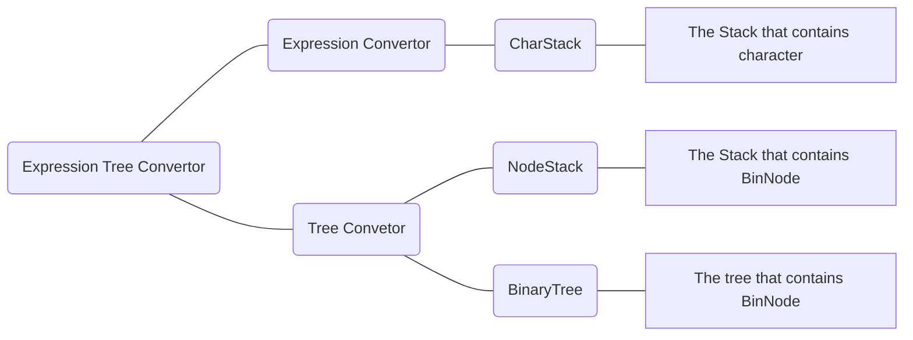

# ExpressionTree

# 1. Expression Tree

 

 

## 1-A.  What is Expression Tree?

 

The expression tree is a **BinaryTree** that **contains all operands and operators** of an expression. Let's assume that there is an expression "**1+2*7**".  Then this expression can be converted into the following **BinaryTree**.

 

 

As you can see in above *Figure 1-1*,  **one operand node** is surrounded with **child nodes that contain an operand or an operator**.  If so, how can this expression tree calculate the result? In case of the expression tree, **the higher the level of the operator node, the faster it is calculated**. On this expression tree, **as the level of  the multiplication operator between 2 and 7 is highest**, it is calculated at the **first time**. As a result, the tree is converted into following tree in *Figure 1-2*.

 

 

 

After that, **the same process** is also applied to **other remaining nodes**. As a result, the **total calculation value is evaluated as 1+14 = 15**. As you can see them, using expression tree is an easy job. However, the difficulty in expression tree comes from **making tree based on expression**.

 

 

## 1-B. How to convert expression to ExpressionTree?

 

If we are given infix expression, how can we change it as an expression tree? For doing so, the **1 process is required**.

 

What you are required is to change **infix expression to postfix expression**. What changes it to postfix expression is [Expression Convertor](https://github.com/Yangseungchan/DataStructure-based-on-C/tree/master/Stacks/ExpressionConvertor) which has been done in chapter **Stacks**. By changing to **postfix expression**, it can be easier for system to **convert expression to expression tree**. 

 

After that, it's now ready to change postfix expression into expression tree. For this process, the two data structures are required. One is **Binary Tree** which is **needed for visualizing expression tree**. This is the changed version of [Binary Search Tree](https://github.com/Yangseungchan/DataStructure-based-on-C/tree/master/Tree/BST) which **has no searching function**. The second data structure is **Stack that contains nodes which are same nodes in Binary Tree** for **inserting nodes into Binary Tree**. How can be done with these two data structures?

 

 

 

Let's build an expression tree with postfix expression such as "7 4 2 * + 1 -" which came from infix expression "7+4*2-1". 
Unlike the convertor from infix to postfix, the operands are also pushed into stack. And the operators are also pushed into Stack. However, when an operator is detected by peeking the stack, the operator is popped with two nodes(mostly operands but sometimes operators) for making a expression as a pair of one operator with two operands like above Figure 1-2-1. What you can notice is that the first popped operand becomes right child of the operator and the second popped one becomes left child of the operator which is for making them as the order of calculation. Once the subtree which has three nodes is made, the root node of the subtree is supposed to be pushed into stack. 

 

 

 

 

Likewise, if the other operator node which was pushed but has no child nodes is detected, then the two nodes which had been pushed is popped to create the subtree like above Figure 1-2-2. These processes are repeated until there is nothing to read from given postfix expression. After the processes are done, finally, the finshed expression tree is created like Figure 1-2-3.

 

   

 

 
  
To sum up those things, it can be summarized as above *Figure 1-3*.

 

 

# 2. ADT(Abstract Data Type)

 

 

## 2-1. DataStructures for Expression Tree Convertor

 

 

 

## 2-2. Source codes' flows of ExpressionTree

 

 

As I mentioned, **for converting given expression into expression tree**, it is needed to convert it to **postfix expression**. The ExpressionConvertor uses two source codes named *CharStack.c* and *ExpressionConvertor.c*. After that, the **postfix expression needs to be converted into ExpressionTree** using **Tree Convertor**. **Tree convertor** uses three source codes named *NodeStack.c*, *BinaryTree.c* and *ExpressionTree.c*. Above *Figure 2-1* is the diagram about these procedures.

 

 

# 3. Functions

 

 

## 3-1.

 

 

 

## 3-2.

 

 

# 4. Conclusion
